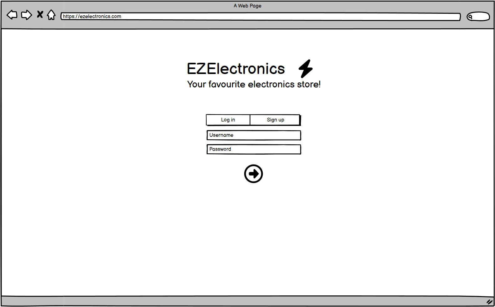
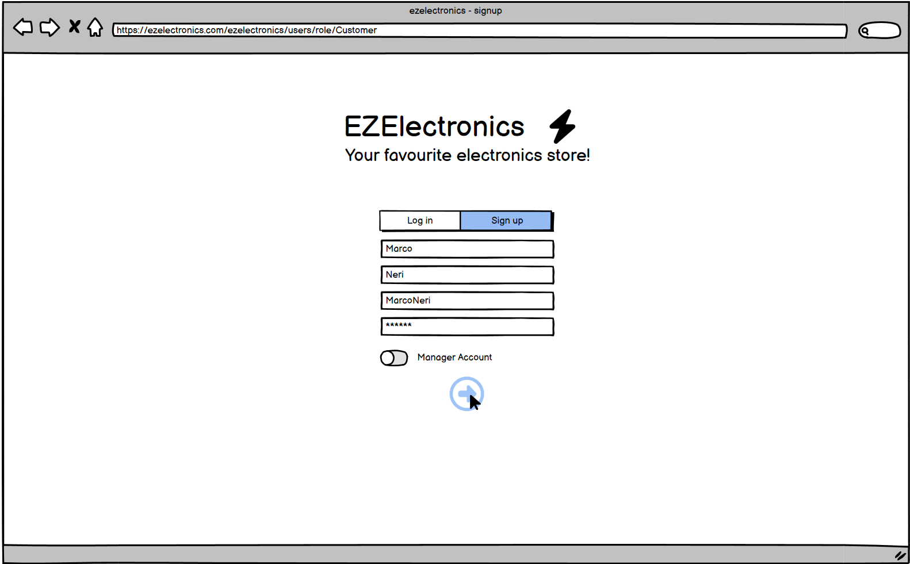
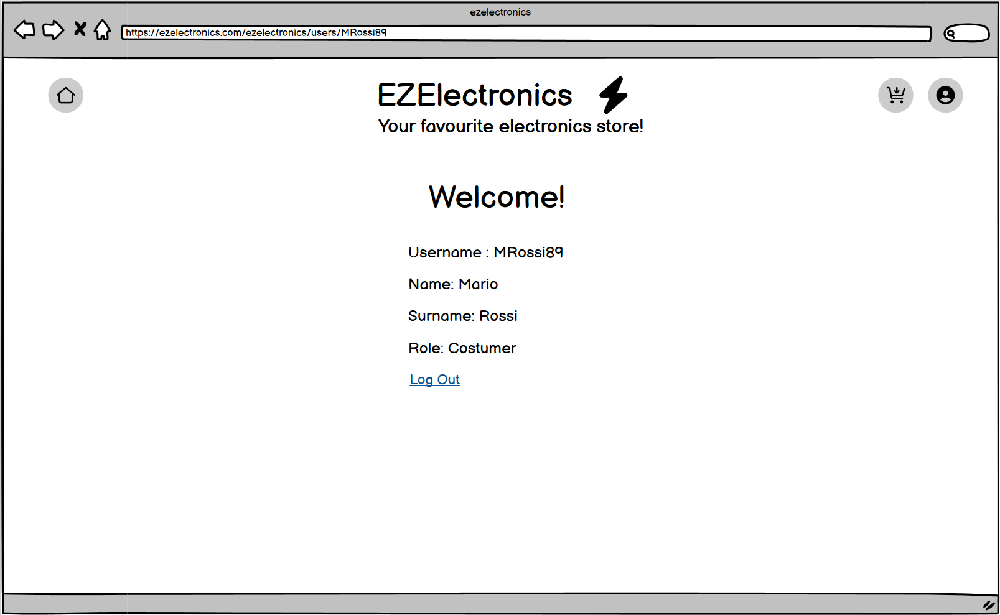
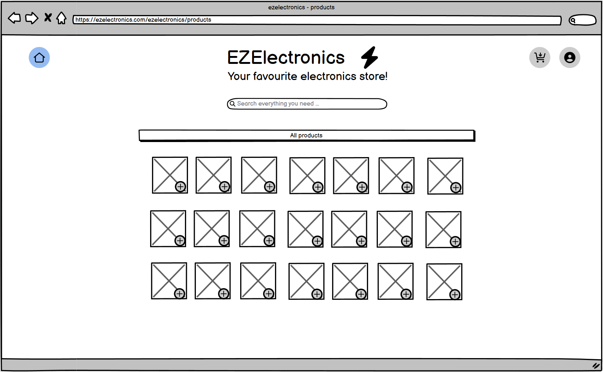
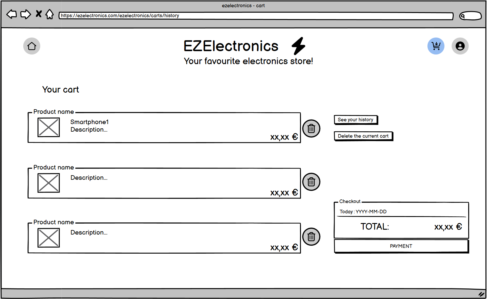
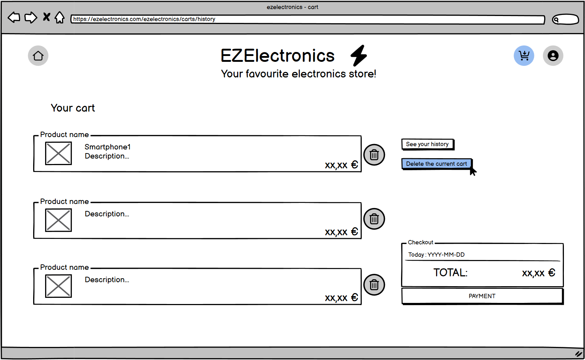

# Graphical User Interface Prototype - CURRENT

Authors: Team 62

Date: 03/05/2024

Version: 1.2

## Home Page
- Taking in account that only logged in user can effectively use the website, the home page is the user account page login or signup.

- When a user is logged in, the personal account page is shown and the user can decide to Log out or to delete his account.

- Clicking in the Home button will lead the user to the product catalogue home page, where the user can navigate with a search bar and add items to the cart via '+' button.

## Manager Account Page
- The Manager Account page shows the personal information, logout and manage its own products.

- Manager products page

## Cart
- The user can see the products in his cart and proceed to checkout

- Cart history

- Button to delete all the current cart
