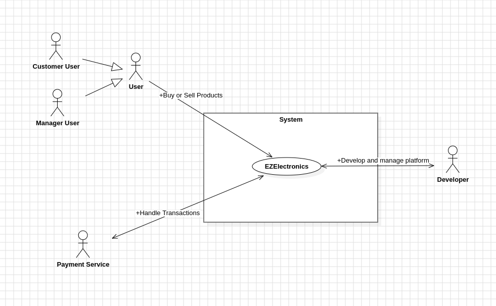
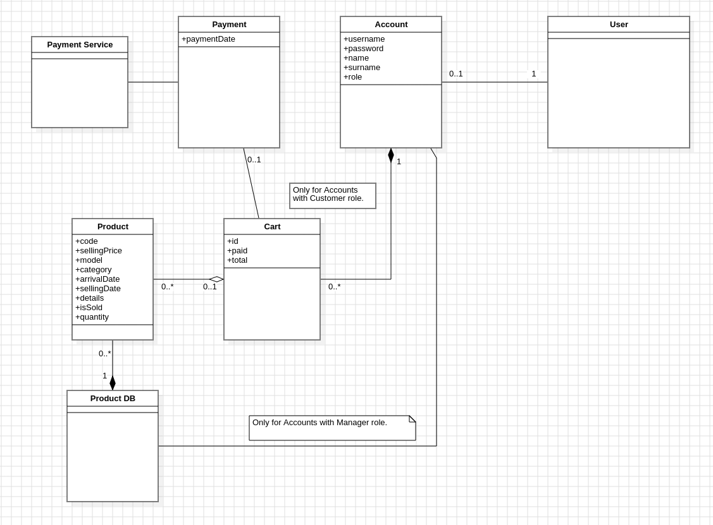
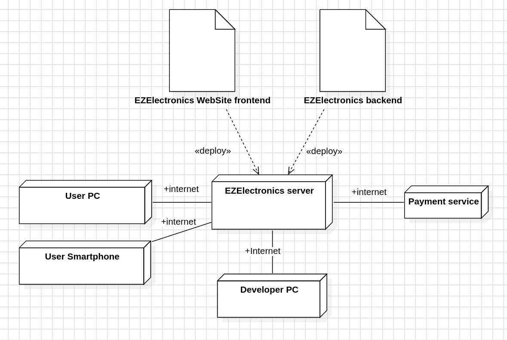

# Requirements Document - current EZElectronics

Date:30/04/2024

Version: V1.6

| Version number | Change |
| :------------: | :----: |
|       V1.1        | Define StakeHolders, Actors, Table of Rights, Functional requirements, Stories and Personas, Interfaces, Context Diagram, NFR |
|       V1.2        | Add Use Case Diagram and Use cases |
|       V1.3        | Update Use cases, add glossary, fix FRs, format document |
|       V1.4        | Update Use cases, update stories and personas, update FRs, update glossary, add Deployment Diagram |

# Contents

- [Requirements Document - current EZElectronics](#requirements-document---current-ezelectronics)
- [Contents](#contents)
- [Informal description](#informal-description)
- [Stakeholders](#stakeholders)
- [Context Diagram and interfaces](#context-diagram-and-interfaces)
  - [Context Diagram](#context-diagram)
  - [Interfaces](#interfaces)
- [Stories and personas](#stories-and-personas)
- [Functional and non functional requirements](#functional-and-non-functional-requirements)
  - [Functional Requirements](#functional-requirements)
  - [Table of rights](#table-of-rights)
  - [Non Functional Requirements](#non-functional-requirements)
- [Use case diagram and use cases](#use-case-diagram-and-use-cases)
  - [Use case diagram](#use-case-diagram)
  - [Use case 1, UC1](#use-case-1-uc1)
    - [Scenario UC1.1](#scenario-uc11)
    - [Scenario UC1.2](#scenario-uc12)
  - [Use case 2, UC2](#use-case-2-uc2)
    - [Scenario UC2.1](#scenario-uc21)
  - [Use case 3, UC3](#use-case-3-uc3)
    - [Scenario UC3.1](#scenario-uc31)
    - [Scenario UC3.2](#scenario-uc32)
    - [Scenario UC3.3](#scenario-uc33)
  - [Use case 4, UC4](#use-case-4-uc4)
    - [Scenario UC4.1](#scenario-uc41)
    - [Scenario UC4.2](#scenario-uc42)
    - [Scenario UC4.3](#scenario-uc43)
    - [Scenario UC4.4](#scenario-uc44)
  - [Use case 5, UC5](#use-case-5-uc5)
    - [Scenario UC5.1](#scenario-uc51)
    - [Scenario UC5.2](#scenario-uc52)
    - [Scenario UC5.3](#scenario-uc53)
    - [Scenario UC5.4](#scenario-uc54)
    - [Scenario UC5.5](#scenario-uc55)
    - [Scenario UC5.2.1](#scenario-uc521)
    - [Scenario UC5.2.2](#scenario-uc522)
  - [Use case 6, UC6](#use-case-6-uc6)
    - [Scenario UC6.1](#scenario-uc61)
    - [Scenario UC6.1.1](#scenario-uc611)
  - [Use case 7, UC7](#use-case-7-uc7)
    - [Scenario UC7.1](#scenario-uc71)
    - [Scenario UC7.2](#scenario-uc72)
    - [Scenario UC7.3](#scenario-uc73)
    - [Scenario UC7.4](#scenario-uc74)
  - [Use case 8, UC8](#use-case-8-uc8)
    - [Scenario UC8.1](#scenario-uc81)
    - [Scenario UC8.2](#scenario-uc82)
    - [Scenario UC8.3](#scenario-uc83)
    - [Scenario UC8.4](#scenario-uc84)
    - [Scenario UC8.1.1](#scenario-uc811)
    - [Scenario UC8.3.1](#scenario-uc831)
- [Glossary](#glossary)
- [System Design](#system-design)
- [Deployment Diagram](#deployment-diagram)

# Informal description

EZElectronics (read EaSy Electronics) is a software application designed to help managers of electronics stores to manage their products and offer them to customers through a dedicated website. Managers can assess the available products, record new ones, and confirm purchases. Customers can see available products, add them to a cart and see the history of their past purchases.

# Stakeholders

| Stakeholder name      | Description |
| :--------------:      | :---------: |
| Customer user         | People that want to buy electronics products  |
| Manager user          | Electronics products companies that are register in the platform|
| Board of directors    | All EZElectonics stakeholders|
| Competitors           | Other online electronics component stores |
| Payment service       | All method that allow user to pay products in the cart|
| Developer             | The team in charge of developing the platform|

# Context Diagram and interfaces

## Context Diagram

| Actor             | Description |
| :--------------:  | :---------: |
| Customer user     |  People that want to buy electronics products  |
| Manager user      |  Electronics products companies that are register in the platform|
| Payment service   | All method that allow user to pay pruducts in the cart|
|Developer          | The team in charge of developing the platform|

## Interfaces

|   Actor       | Logical Interface | Physical Interface    |
| :-------:     | :---------------: | :----------------:    |
|Customer user  | GUI               | PC,Smartphone         |
|Manager user   | GUI               | PC                    |
|Payment service| Internet          | Intenet               |
|Developer      | CLI               | PC                    |

# Stories and personas

Customer User: Simone: he is a 24 years old hobbyist that often buyes electronic components for his embedded systems projects. He is looking for a website where he can buy electronic components for his projects. He wants to search specific products, add them to a cart and pay for them online. He browses around the website looking for the suitable components for his designs adding them to the cart. Once he has done with the research, he buys stuff paying online with the different offered channel.

Manager User: Lisa: she is the sales manager of the STMicroelectronics company. She wants to upload new sensors and boards of her company to the website. She wants to see the products that are already available, add new ones, and mark them as sold when they are purchased.

Developer: Leonardo: He is the one in charge to develop the website. He needs to have testing APIs to test the functionalities of the website. He most often uses the command line interface to test the functionalities of the website such as adding a product, deleting a product/all products, adding or deleting accounts etc.

Payment Service: PayPal: It is the service that allows the customer to pay for the products in the cart. When user pays for the cart, the payment service forwards the amount to the bank account of the companies that sell the products.

# Functional and non functional requirements

## Functional Requirements

|  ID   | Description |
| :---: | :---------: |
|   FR1|Authorize and Authenticate|
|       FR1.1|Log in |
|       FR1.2|Log Out |
|   FR2|Create Account|
|   FR3|Manage Account |
|       FR3.1|Get Account Information |
|       FR3.2|Delete Account|
|   FR4|Manage products|
|       FR4.1|Add a product|
|       FR4.2|Add quantity to a product|
|       FR4.3|Mark a product as sold|
|       FR4.4|Delete a specific product|
|   FR5|Show products|
|       FR5.1|Show the product that matches an ID|
|       FR5.2|Show all products of a category|
|       FR5.3|Show all products that match a specific model|
|       FR5.4|Show all products|
|   FR6|Manage carts|
|       FR6.1|Show current cart|
|       FR6.2|Add a product to the cart|
|       FR6.3|Remove a product from the cart|
|       FR6.4|Delete the current cart|
|       FR6.5|Show the history of paid carts|
|   FR7|Manage transaction|
|       FR7.1|Pay for the current cart|

## Table of rights

|  Actor    | FR1.1 | FR1.2 | FR2 | FR3.1 | FR3.2 | FR4.1 | FR4.2 | FR4.3 | FR4.4 | FR5.1 | FR5.2 | FR5.3 | FR5.4 | FR6.1 | FR6.2 | FR6.3 | FR6.4 | FR6.5 | FR7.1 |
| :---: | :---: | :---: | :---: | :---: | :---: | :---: | :---: | :---: | :---: | :---: | :---: | :---: | :---: | :---: | :---: | :---: | :---: | :---: | :---: |
|Non-registered user    |Y|N|Y|Y|Y|N|N|N|N|N|N|N|N|N|N|N|N|N|N|
|Customer user          |Y|Y|Y|Y|Y|N|N|N|N|Y|Y|Y|Y|Y|Y|Y|Y|Y|Y|
|Manager user           |Y|Y|Y|Y|Y|Y|Y|Y|Y|Y|Y|Y|Y|N|N|N|N|N|N|
|Developer              |Y|Y|Y|Y|Y|Y|Y|Y|Y|Y|Y|Y|Y|Y|Y|Y|Y|Y|Y|

## Non Functional Requirements

|   ID    | Type (efficiency, reliability, ..) | Description | Refers to |
| :-----: | :---------------------------------: | :---------: | :-------: |
|  NFR1   | Usability                          | Website GUI should be able to adapt to both desktop (up to 30in displays) and mobile screens (down to 4in displays) | GUI |
|  NFR2   | Efficiency                         | All back-end operations should be performed in less that 0.1s | server |
|  NFR3   | Reliability                        | The platform should be able to perform a backup and restore it every 24h | database |
| NFR4    | Scalability                        | The platform should be able to handle up to 1000 simultaneous users | server/database |
| NFR5    | Scalability                        | The platform should be able to handle up to 1000000 simultaneous products | server/database |
| NFR6    | Maintainability                    | The platform should be able to be updated without stopping the service | server |
| NFR7    | Availability                       | The platform should be available 99.99% of the time | server |
| NFR8    | Legal                              | The platform should be compliant with GDPR and EU laws | whole platform |
| NFR9    | Security                           | Password should be encrypted in the database | database |

# Use case diagram and use cases

## Use case diagram

|ID| Use Case  | Actor|
|:-----:|:-----: |:-----: 
|UC1|Login| Users |
|UC2|Logout| Users |
|UC3|Create new user| Non-registered users|
|UC4|Manage Account| Users|
|UC5|Manage Cart| Customer Users|
|UC6|Pay Current Cart| Customer Users|
|UC7|Show Products| Users|
|UC8|Manage Products| Manager Users|

### Use case 1, UC1

| Actors Involved  |  Customer User, Manager User   |
| :--------------: | :------------------------------------------------------------------:    |
|   Precondition   | User has an account                                |
|  Post condition  |  User is logged-in                                 |
| Nominal Scenario |  User wants to authenticate himself/herself (UC1.1)|
|     Variants     |   -  |
|    Exceptions    |   User wants to authenticate with wrong credentials(UC1.2)                         |

#### Scenario UC1.1

|  Scenario UC1.1  |           |
| :------------: | :------------------------------------------------------------------------:  |
|  Precondition  | User has a Customer account                              |
| Post condition |  User is logged-in as customer                           | 
|     **Step#**      |      **Description**                                         |
|       1        |     insert the username                                  |
|       2        |     insert password                                      |
|       3        |     click login                                          |

#### Scenario UC1.2
|  Scenario UC1.2  |                |
| :------------: | :------------------------------------------------------------------------: |
|  Precondition  | User has an account |
| Post condition |  User is not logged in |
|     **Step#**     |        **Description**      |
|       1       |     insert the username               |
|       2       |     insert password          |
|       3       |     click login        |
|       4       |     System show "Incorrect username and/or password" -> return to step 1   |

### Use case 2, UC2

| Actors Involved  |  Customer User, Manager User   |
| :--------------: | :------------------------------------------------------------------:    |
|   Precondition   | User is logged in                                |
|  Post condition  |  User is not logged anymore                                |
| Nominal Scenario |  User wants to deauthenticate himself/herself (UC2.1)|
|     Variants     |   -  |
|    Exceptions    |   -  |

#### Scenario UC2.1

|  Scenario UC2.1  |           |
| :------------: | :------------------------------------------------------------------------:  |
|  Precondition  | User is logged in                                     |
| Post condition |  User is not logged anymore                           | 
|     **Step#**      |      **Description**                                      |
|       1        |     click on logout button                            |
|       2        |     click confirm                                     |

### Use case 3, UC3

| Actors Involved  |  User  |
| :--------------: | :------------------------------------------------------------------:    |
|   Precondition   | New user wants to access the platform but does not have an account |
|  Post condition  |  New user has an account |
| Nominal Scenario |  Customer User wants to create a new account (UC3.1)|
|     Variants     |   User want to create a manager account (UC3.2)  |
|    Exceptions    |   Username already existing (UC3.3)  |

#### Scenario UC3.1

|  Scenario UC3.1  |           |
| :------------: | :------------------------------------------------------------------------:  |
|  Precondition  | Customer User does not have an account                |
| Post condition |  Customer User has created an account                 | 
|     **Step#**      |      **Description**                                      |
|       1        |     click on signup button                     |
|       2        |     fills name, surname, username, password           |
|       3        |     click next                                     |

#### Scenario UC3.2

|  Scenario UC3.2  |           |
| :------------: | :------------------------------------------------------------------------:  |
|  Precondition  | Manager User does not have an account                |
| Post condition |  Manager User has created an account                 | 
|     **Step#**      |      **Description**                                      |
|       1        |     click on signup button                     |
|       2        |     fills name, surname, username, password           |
|       3        |     check "manager account"                           |
|       4        |     click next                                     |

#### Scenario UC3.3

|  Scenario UC3.3  |           |
| :------------: | :------------------------------------------------------------------------:  |
|  Precondition  | User does not have an account                         |
| Post condition | User has not created an account                       | 
|     **Step#**      |      **Description**                                      |
|       1        |     click on signup button                     |
|       2        |     fills name, surname, username, password           |
|       3        |     check "manager account" if manager                |
|       4        |     click next                                     |
|       5        |     System show "Username already existing" -> return to step 1|

### Use case 4, UC4

| Actors Involved  |  User  |
| :--------------: | :------------------------------------------------------------------:                 |
|   Precondition   | - |
|  Post condition  | User has managed an account |
| Nominal Scenario | User wants to see info about an account (UC4.1) |
|     Variants     | User wants to delete an account (UC4.2)   |
|    Exceptions    | User wants to see info about a non existing account (UC4.3), User wants to delete a non existing account (UC4.4) |

#### Scenario UC4.1

|  Scenario UC4.1  |           |
| :------------: | :------------------------------------------------------------------------:  |
|  Precondition  | User wants to see info about an existing account      |
| Post condition |  User has seen the account information                | 
|     **Step#**      |      **Description**                                      |
|       1        |     click on account button                           |
|       2        |     insert username                                   |
|       3        |     click on show account information                 |
|       4        |     system show account information                   |

#### Scenario UC4.2

|  Scenario UC4.2  |           |
| :------------: | :------------------------------------------------------------------------:  |
|  Precondition  | User wants to delete an existing account              |
| Post condition |  User has deleted the account                         | 
|     **Step#**      |      **Description**                                      |
|       1        |     click on account button                           |
|       2        |     insert username                                   |
|       3        |     click on delete account                           |
|       4        |     click confirm                                     |
|       5        |     system show "Account deleted"                     |

#### Scenario UC4.3

|  Scenario UC4.3  |           |
| :------------: | :------------------------------------------------------------------------:  |
|  Precondition  | User wants to see info about a non existing account   |
| Post condition |  User has not seen the account information            | 
|     **Step#**      |      **Description**                                      |
|       1        |     click on account button                           |
|       2        |     insert username                                   |
|       3        |     click on show account information                 |
|       4        |     system show "Account not found" -> return to step 1|

#### Scenario UC4.4

|  Scenario UC4.4  |           |
| :------------: | :------------------------------------------------------------------------:  |
|  Precondition  | User wants to delete a non existing account           |
| Post condition |  User has not deleted the account                     |
|     **Step#**      |      **Description**                                      |
|       1        |     click on account button                           |
|       2        |     insert username                                   |
|       3        |     click on delete account                           |
|       4        |     click confirm                                     |
|       5        |     system show "Account not found" -> return to step 1|

### Use case 5, UC5

| Actors Involved  |  Customer User  |
| :--------------: | :------------------------------------------------------------------:                 |
|   Precondition   | User has logged in as Customer User |
|  Post condition  | User has managed the cart |
| Nominal Scenario | User wants to see the current cart (UC5.1), User wants to add a product to the cart (UC5.2), User wants to see the history of paid carts (UC5.3), User wants to remove a product from the cart (UC5.4), User wants to delete the current cart (UC5.5) |
|     Variants     | - |
|    Exceptions    | User wants to add a product that is already in another cart (UC5.2.1), User wants to add a product that has already been sold (UC5.2.2) |

#### Scenario UC5.1

|  Scenario UC5.1  |           |
| :------------: | :------------------------------------------------------------------------:  |
|  Precondition  | User wants to see the current cart |
| Post condition |  User has seen the current cart information                | 
|     **Step#**      |      **Description**                                      |
|       1        |     click on cart button                           |
|       2        |     system show the current cart information                   |

#### Scenario UC5.2

|  Scenario UC5.2  |           |
| :------------: | :------------------------------------------------------------------------:  |
|  Precondition  | User wants to add a product to the cart                |
| Post condition |  User has added the product to the cart                | 
|     **Step#**      |      **Description**                               |
|       1        |     click on "add to cart" button next to the product to add   |
|       4        |     system show "Product added to cart"                |

#### Scenario UC5.3

|  Scenario UC5.3  |           |
| :------------: | :------------------------------------------------------------------------:  |
|  Precondition  | User wants to see the history of paid carts                |
| Post condition |  User has seen the history of paid carts                | 
|     **Step#**      |      **Description**                                      |
|       1        |     click on cart button                           |
|       2        |     click on history of paid carts button            |
|       3        |     system show the history of paid carts                   |

#### Scenario UC5.4

|  Scenario UC5.4  |           |
| :------------: | :------------------------------------------------------------------------:  |
|  Precondition  | User wants to remove a product from the cart |
| Post condition |  User has removed the product from the cart                | 
|     **Step#**      |      **Description**                                      |
|       1        |     click on cart button                                     |
|       2        |     click on the delete button next to the product to remove      |
|       4        |     system show "Product removed from cart"                   |

#### Scenario UC5.5

|  Scenario UC5.5 |           |
| :------------: | :------------------------------------------------------------------------:  |
|  Precondition  | User wants to delete the current cart                |
| Post condition |  User has deleted the current cart                | 
|     **Step#**      |      **Description**                                      |
|       1        |     click on cart button                           |
|       2        |     click on delete cart button            |
|       3        |     system show "Cart deleted"                   |

#### Scenario UC5.2.1

|  Scenario UC5.2.2  |           |
| :------------: | :------------------------------------------------------------------------:  |
|  Precondition  | User wants to add a product that is already in another cart                |
| Post condition |  User has not added the product to the cart                |
|     **Step#**      |      **Description**                                      |
|       1        |     click on "add to cart" button next to the product to add    |
|       2        |     system show "Product already in another cart"   |

#### Scenario UC5.2.2

|  Scenario UC5.2.3  |           |
| :------------: | :------------------------------------------------------------------------:  |
|  Precondition  | User wants to add a product that has already been sold                |
| Post condition |  User has not added the product to the cart                |
|     **Step#**      |      **Description**                                      |
|       1        |     click on "add to cart" button next to the product to add    |
|       2        |     system show "Product already sold"                   |

### Use case 6, UC6

| Actors Involved  |  Customer User  |
| :--------------: | :------------------------------------------------------------------:                 |
|   Precondition   | User has logged in as Customer User |
|  Post condition  | User has payed the current cart |
| Nominal Scenario | User wants to pay for the current cart (UC6.1) |
|     Variants     | - |
|    Exceptions    | User wants to pay for an empty cart (UC6.1.1) |

#### Scenario UC6.1

|  Scenario UC6.1  |           |
| :------------: | :------------------------------------------------------------------------:  |
|  Precondition  | User wants to pay for the current cart                |
| Post condition |  User has paid for the current cart                | 
|     **Step#**      |      **Description**                                      |
|       1        |     click on cart button                           |
|       2        |     click on pay cart button                                   |
|       3        |     system show "Cart paid"                   |

#### Scenario UC6.1.1

|  Scenario UC6.1.1  |           |
| :------------: | :------------------------------------------------------------------------:  |
|  Precondition  | User wants to pay for an empty cart                |
| Post condition |  User has not paid for the current cart                |
|     **Step#**      |      **Description**                                      |
|       1        |     click on cart button                           |
|       2        |     click on pay cart button            |
|       3        |    system show "Cart is empty"                   |

### Use case 7, UC7

| Actors Involved  |  User  |
| :--------------: | :------------------------------------------------------------------:                 |
|   Precondition   | User is logged in |
|  Post condition  | User has seen the products |
| Nominal Scenario | User wants to see the products that match an ID (UC7.1) |
|     Variants     | User wants to see all products of a category (UC7.2), User wants to see all products that match a specific model (UC7.3), User wants to see all products (UC7.4) |
|    Exceptions    | - |

#### Scenario UC7.1

|  Scenario UC7.1  |           |
| :------------: | :------------------------------------------------------------------------:  |
|  Precondition  | User wants to see the product that matches an ID                |
| Post condition |  User has seen the product that matches the ID                | 
|     **Step#**      |      **Description**                                      |
|       1        |     insert the product ID into the search bar    |
|       2        |     click on search button            |
|       3        |     system show the product that matches the id     |

#### Scenario UC7.2

|  Scenario UC7.2  |           |
| :------------: | :------------------------------------------------------------------------:  |
|  Precondition  | User wants to see all the products of a category                |
| Post condition |  User has seen all the products of a category                | 
|     **Step#**      |      **Description**                                      |
|       1        |     leave text empty in the search bar    |
|       2        |     click on the category button            |
|       3        |     click on the category of interest            |
|       4        |     system show all the products of the category     |

#### Scenario UC7.3

|  Scenario UC7.3  |           |
| :------------: | :------------------------------------------------------------------------:  |
|  Precondition  | User wants to see all the products that match a specific model                |
| Post condition |  User has seen all the products that match the model                | 
|     **Step#**      |      **Description**                                      |
|       1        |     insert the model into the search bar    |
|       2        |     click on search button            |
|       3        |     system show all the products that match the model     |

#### Scenario UC7.4

|  Scenario UC7.4  |           |
| :------------: | :------------------------------------------------------------------------:  |
|  Precondition  | User wants to see all the products                |
| Post condition |  User has seen all the products                | 
|     **Step#**      |      **Description**                                      |
|       1        |     leave text empty in the search bar    |
|       2        |     click on search button            |
|       3        |     system show all the products     |

### Use case 8, UC8

| Actors Involved  |  Manager User  |
| :--------------: | :------------------------------------------------------------------:                 |
|   Precondition   | User is logged in as Manager User |
|  Post condition  | User has managed the products |
| Nominal Scenario | User wants to add a product (UC8.1), User wants to add quantity to a product (UC8.2), User wants to mark a product as sold (UC8.3), User wants to delete a specific product (UC8.4) |
|     Variants     | - |
|    Exceptions    | User wants to add a product that is already existing (UC8.1.1), User wants to mark a product as sold that is already sold (UC8.3.1) |

#### Scenario UC8.1

|  Scenario UC8.1  |           |
| :------------: | :------------------------------------------------------------------------:  |
|  Precondition  | User wants to add a product                |
| Post condition |  User has added the product                | 
|     **Step#**      |      **Description**                                      |
|       1        |     click on add product button                           |
|       2        |     fills the product information                                   |
|       3        |     click on add product button                           |
|       4        |     system show "Product added"                   |

#### Scenario UC8.2

|  Scenario UC8.2  |           |
| :------------: | :------------------------------------------------------------------------:  |
|  Precondition  | User wants to add quantity to a product                |
| Post condition |  User has added quantity to the product                | 
|     **Step#**      |      **Description**                                      |
|       1        |     click on add quantity button next to the product   |
|       2        |     fills the quantity      |
|       3        |     click on confirm                           |
|       4        |     system show "Quantity added"                   |

#### Scenario UC8.3

|  Scenario UC8.3  |           |
| :------------: | :------------------------------------------------------------------------:  |
|  Precondition  | User wants to mark a product as sold                |
| Post condition |  User has marked the product as sold                | 
|     **Step#**      |      **Description**                                      |
|       1        |     click on mark as sold button next to the product       |
|       2        |     click confirm                           |
|       3        |     system show "Product marked as sold"                   |

#### Scenario UC8.4

|  Scenario UC8.4  |           |
| :------------: | :------------------------------------------------------------------------:  |
|  Precondition  | User wants to delete a specific product                |
| Post condition |  User has deleted the product                | 
|     **Step#**      |      **Description**                                      |
|       1        |     click on delete product button next to the product        |
|       2        |     click confirm                                  |
|       3        |     system show "Product deleted"                   |

#### Scenario UC8.1.1

|  Scenario UC8.1.1  |           |
| :------------: | :------------------------------------------------------------------------:  |
|  Precondition  | User wants to add a product that is already existing     |
| Post condition |  User has not added the product                | 
|     **Step#**      |      **Description**                                      |
|       1        |     click on add product button                           |
|       2        |     fills the product information     |
|       3        |     click on add product button                           |
|       4        |     system show "Product already existing" -> return to step 2|

#### Scenario UC8.3.1

|  Scenario UC8.3.1  |           |
| :------------: | :------------------------------------------------------------------------:  |
|  Precondition  | User wants to mark a product as sold that is already sold   |
| Post condition |  -  | 
|     **Step#**  |      **Description**                                      |
|       1        |     click on mark as sold button next to the product       |
|       2        |     click confirm                           |
|       3        |     system show "Product already sold"                   |

# Glossary

- User
    - Person who has an account in the platform
- Customer User
    - User who buys products
- Manager User
    - User who sells products
- Account
    - It has a username, a password, a name, a surname, a role and it can be linked to one or multiple Carts
- Cart
    - List of products that a customer wants to buy
    - It has an id, it is associated to an account with role "customer", it has a list of products, a total price and it can be linked to a Payment when it is paid
- Payment
    - Transaction that allows a customer to pay for a cart
    - It is associated to a cart, it has a payment date
- Product
    - Electronic component available for sale, it can be one of the products contained in the Product DB
    - It can be associated to zero or one cart per user
    - It has a unique code, a selling price, a model, a category, a selling date, an arrival date, details, quantity and it can be marked as sold
- Product DB
    - Database that stores all the products, manager users can add, delete, modify products

# System Design

# Deployment Diagram

The deployment diagram consists of the following nodes:
 - EZElectronics Server: The server that hosts the website backend and frontend
 - User PC: The PC of the user that accesses the website
 - User Smartphone: The smartphone of the user that accesses the website
 - Payment Service: The service that allows the user to pay for the products in the cart
 - Developer PC: The PC of the developer that tests and develop the functionalities of the website

