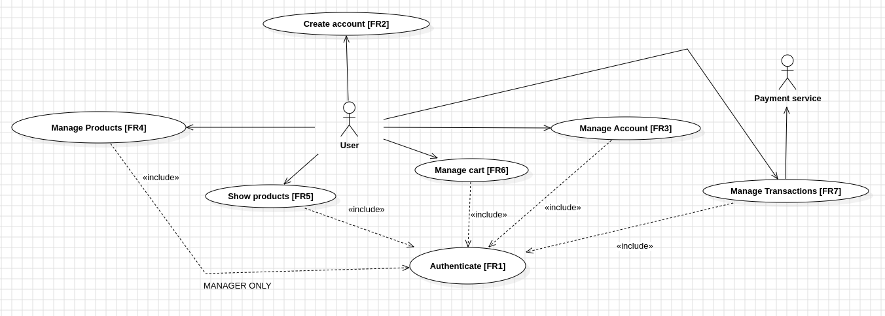

# Requirements Document - current EZElectronics

Date:30/04/2024

Version: V1.6

| Version number | Change |
| :------------: | :----: |
|       V1.1        |    Define StakeHolders, actors, Functional requirements, Stories and Personas, Interfaces   |
|       V1.2        |    Add Context Diagram |
|       V1.3        |    Fix Context Diagram, Add NFR |
|       V1.4        |    Fix StakeHolders, Fix interfaces, add table of rights, Fix stories and personas|
|V1.5|Fix table of contents|
|V1.6| Add Use Case Diagram and Use cases |

# Contents

- [Requirements Document - current EZElectronics](#requirements-document---current-ezelectronics)
- [Contents](#contents)
- [Informal description](#informal-description)
- [Stakeholders](#stakeholders)
- [Context Diagram and interfaces](#context-diagram-and-interfaces)
  - [Context Diagram](#context-diagram)
  - [Interfaces](#interfaces)
- [Stories and personas](#stories-and-personas)
- [Functional and non functional requirements](#functional-and-non-functional-requirements)
  - [Functional Requirements](#functional-requirements)
  - [Table of rights](#table-of-rights)
  - [Non Functional Requirements](#non-functional-requirements)
- [Use case diagram and use cases](#use-case-diagram-and-use-cases)
  - [Use case diagram](#use-case-diagram)
    - [Use case 1, UC1](#use-case-1-uc1)
      - [Scenario 1.1](#scenario-11)
      - [Scenario 1.2](#scenario-12)
      - [Scenario 1.x](#scenario-1x)
    - [Use case 2, UC2](#use-case-2-uc2)
    - [Use case x, UCx](#use-case-x-ucx)
- [Glossary](#glossary)
- [System Design](#system-design)
- [Deployment Diagram](#deployment-diagram)

# Informal description

EZElectronics (read EaSy Electronics) is a software application designed to help managers of electronics stores to manage their products and offer them to customers through a dedicated website. Managers can assess the available products, record new ones, and confirm purchases. Customers can see available products, add them to a cart and see the history of their past purchases.

# Stakeholders

| Stakeholder name | Description |
| :--------------: | :---------: |
| Customer user         |  People that want to buy electronics products  |
| Manager user |  Electronics products companies that are register in the platform|
| Board of directors   |  All EZElectonics stakeholders|
| Competitors       | Other online electronics component stores |
| Payment service  | All method that allow user to pay pruducts in the cart|
|Developer| The team in charge of developing the platform|

# Context Diagram and interfaces

## Context Diagram

| Actor | Description |
| :--------------: | :---------: |
| Customer user         |  People that want to buy electronics products  |
| Manager user |  Electronics products companies that are register in the platform|
| Payment service  | All method that allow user to pay pruducts in the cart|
|Developer| The team in charge of developing the platform|

## Interfaces

|   Actor   | Logical Interface | Physical Interface |
| :-------: | :---------------: | :----------------: |
| Customer user |     GUI            |     PC,Smartphone|
|Manager user| GUI              |        PC         |
|Payment service| Internet      |     Intenet         |
|Developer| CLI         | PC|

# Stories and personas

- Customer user Leonardo:  He is a regular costumer who likes to be a maker, who spends his free time in buying electronics components for his embedded systems projects. He browses around the website looking for the suitable components for his designs adding them to the cart. Once he has done with the research, he buys stuff paying online with the different offered channel.
- Manager user Lisa: She is the sales manager of the STMicroelectronics company, who has a company profile in the website, she can upload when required new sensors and board of its company.
- Developer Simone: He is the one in charge to manage the website databeses to ensure the correct placement of product, the list of the signed users

# Functional and non functional requirements

## Functional Requirements

|  ID   | Description |
| :---: | :---------: |
|FR1  |     Authorize and  Authenticate      |
|   FR1.1|   Log in Log Out          |
|   FR1.2 |   Manage Account    |
|     FR1.2.1|  Create Account|
|     FR1.2.2|  Delete Account|
|     FR1.2.3|  Delete All Accounts|
|FR2|Manage products|
|   FR2.1|Add a pruduct|
|   FR2.2|Mark a pruduct as sold|
|   FR2.3|Delete all products|
|FR3|Manage carts|
|   FR3.1|Show current cart|
|   FR3.2|Add a product to the cart|
|   FR3.3| Remove a product from the cart|
|   FR3.4| Revove all products in the current cart|
|   FR3.5|Remove all existing carts|
|   FR3.6|Show the history of paid carts|
|F4|Manage transaction|
|   F4.1|Pay for the current cart|

## Table of rights

|  Actor   |FR1.1|FR1.2.1|FR1.2.2|FR1.2.3|FR2.1|FR2.2|FR2.3|FR3.1|FR3.2|FR3.3|FR3.4|FR3.5|FR3.6|F4.1|
| :---: | :--: |:--: |:--: |:--: |:--: |:--: |:--: |:--: |:--: |:--: |:--: |:--: |:--: |:--: |
|Customer user| Y|Y|Y|N|N|N|N|Y|Y|Y|Y|N|Y|Y|
|Manager user | Y|Y|Y|N|Y|Y|N|Y|Y|Y|Y|N|Y|Y|
|Developer | Y|Y|Y|Y|Y|Y|Y|Y|Y|Y|Y|Y|Y|Y|

## Non Functional Requirements

|   ID    | Type (efficiency, reliability, ..) | Description | Refers to |
| :-----: | :---------------------------------: | :---------: | :-------: |
|  NFR1   | Usability                          | Website GUI should be able to adapt to both desktop (up to 30in displays) and mobile screens (down to 4in displays) | GUI |
|  NFR2   | Efficiency                         | All back-end operations should be performed in less that 0.1s | server |
|  NFR3   | Reliability                        | The platform should be able to perform a backup and restore it every 24h | database |
| NFR4    | Scalability                        | The platform should be able to handle up to 1000 simultaneous users | server/database |
| NFR5    | Scalability                        | The platform should be able to handle up to 1000000 simultaneous products | server/database |
| NFR6    | Maintainability                    | The platform should be able to be updated without stopping the service | server |
| NFR7    | Availability                       | The platform should be available 99.99% of the time | server |
| NFR8    | Legal                              | The platform should be compliant with GDPR and EU laws | whole platform |

# Use case diagram and use cases

## Use case diagram

|ID| Use Case  | Actor|
 |:-----:|:-----: |:-----: 
 |UC1|Authentication| Users |
 |UC2|Create new user| Non-registered users|
  |UC3|Manage Account| Users|
  |UC4|Manage Cart| Customer Users|
  |UC5|Pay Current Cart| Customer Users|
  |UC6|Show Product| Customer Users|
  |UC7|Manage Product| Manager Users|
  |UC8|Delete all Accounts| Developers|
  |UC9|Delete all Products| developers|
  |UC10|Delete all Carts| Developers|

### Use case 1, UC1

| Actors Involved  |                                   Customer User, Manager User          |
| :--------------: | :------------------------------------------------------------------: |
|   Precondition   | User has an account |
|  Post condition  |  User is logged-in|
| Nominal Scenario |  User insert username and password in order to authenticate him/herself (UC1.1)|
|     Variants     |   Manager Login (UC1.2)                     |
|    Exceptions    |   wrong credentials(UC1.3)                 |

##### Scenario UC1.1

|  Scenario UC1.1  |                                                                            |
| :------------: | :------------------------------------------------------------------------: |
|  Precondition  | User has a Customer account |
| Post condition |  User is logged-in as customer| 
|     Step#      |                                Description                                 |
|       1        |     insert the username                                                  |
|       2        |     insert password                                                 |
|       3       |     click login                                             |

##### Scenario UC1.2

|  Scenario UC1.1  |                                                                            |
| :------------: | :------------------------------------------------------------------------: |
|  Precondition  | User has a Manager account |
| Post condition |  User is logged-in as manager |
|     Step#      |                                Description                        |
|       1        |     insert the username                                               |
|       2        |     insert password                                                 |
|       3       |     click login                                             |
##### Scenario UC1.3
|  Scenario UC1.1  |                                                                            |
| :------------: | :------------------------------------------------------------------------: |
|  Precondition  | User has a Manager account |
| Post condition |  User is not logged |
|     Step#      |                                Description                        |
|       1        |     insert the username                                               |
|       2        |     insert password                                                 |
|       3       |     click login                                             |
|       4      |     System show "Incorrect username and/or password" -> go to step 1               |

### Use case 2, UC2

| Actors Involved  |                     Customer User, Manager User          |
| :--------------: | :------------------------------------------------------------------: |
|   Precondition   | NA |
|  Post condition  |  Account Created|
| Nominal Scenario |  User fill the form with all the usefull information in order to create an account|
|     Variants     |   Manager Login (UC1.2)                     |
|    Exceptions    |   Required fields (UC1.3)                 |

### Use case x, UCx

..

# Glossary

\<use UML class diagram to define important terms, or concepts in the domain of the application, and their relationships>

\<concepts must be used consistently all over the document, ex in use cases, requirements etc>

# System Design

\<describe here system design>

\<must be consistent with Context diagram>

# Deployment Diagram

\<describe here deployment diagram >
