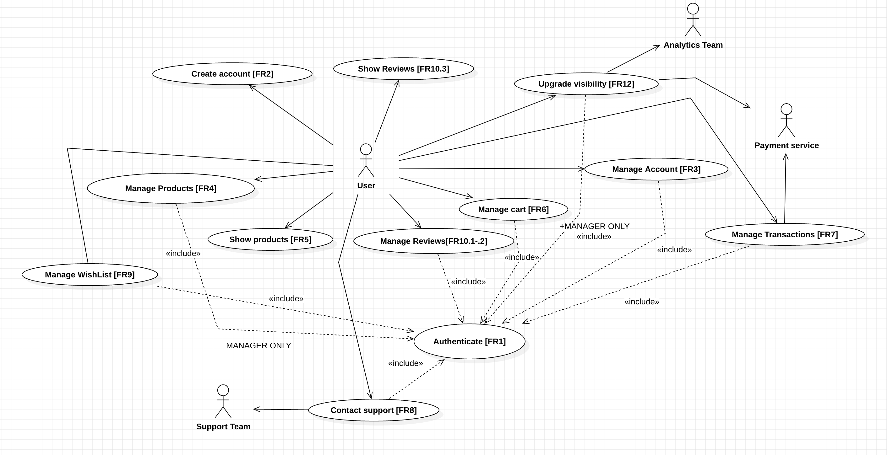

# Requirements Document - future EZElectronics

Date: 04/05/2024

Version: V2 - description of EZElectronics in FUTURE form (as proposed by the team)

| Version number | Change |
| :------------: | :----: |
|       V1.1        | Define StakeHolders, Actors, Table of Rights, Functional requirements, Stories and Personas, Interfaces, Context Diagram, NFR |
|       V1.2        | Define Use Case Diagram, Use Cases, Glossary, System Design, Deployment Diagram description |
|       V1.3        | add use case 12: Contact support |

# Contents

- [Requirements Document - future EZElectronics](#requirements-document---future-ezelectronics)
- [Contents](#contents)
- [Informal description](#informal-description)
- [Stakeholders](#stakeholders)
- [Context Diagram and interfaces](#context-diagram-and-interfaces)
  - [Context Diagram](#context-diagram)
  - [Interfaces](#interfaces)
- [Stories and personas](#stories-and-personas)
- [Functional and non functional requirements](#functional-and-non-functional-requirements)
  - [Functional Requirements](#functional-requirements)
  - [Table of rights](#table-of-rights)
  - [Non Functional Requirements](#non-functional-requirements)
- [Use case diagram and use cases](#use-case-diagram-and-use-cases)
  - [Use case diagram](#use-case-diagram)
    - [Use case 1, UC1](#use-case-1-uc1)
      - [Scenario UC1.1](#scenario-uc11)
      - [Scenario UC1.2](#scenario-uc12)
      - [Scenario UC1.3](#scenario-uc13)
    - [Use case 2, UC2](#use-case-2-uc2)
      - [Scenario UC2.1](#scenario-uc21)
      - [Scenario UC2.2](#scenario-uc22)
      - [Scenario UC2.3](#scenario-uc23)
      - [Scenario UC2.4](#scenario-uc24)
    - [Use case 3, UC3](#use-case-3-uc3)
      - [Scenario UC3.1](#scenario-uc31)
    - [Use case 4, UC4](#use-case-4-uc4)
      - [Scenario UC4.1](#scenario-uc41)
      - [Scenario UC4.2](#scenario-uc42)
      - [Scenario UC4.3](#scenario-uc43)
      - [Scenario UC4.4](#scenario-uc44)
      - [Scenario UC4.5](#scenario-uc45)
      - [Scenario UC4.6](#scenario-uc46)
    - [Use case 5, UC5](#use-case-5-uc5)
      - [Scenario UC5.1](#scenario-uc51)
      - [Scenario UC5.2.1](#scenario-uc521)
      - [Scenario UC5.2.2](#scenario-uc522)
    - [Use case 6, UC6](#use-case-6-uc6)
      - [Scenario UC6.1](#scenario-uc61)
      - [Scenario UC6.2.1](#scenario-uc621)
      - [Scenario UC6.2.2](#scenario-uc622)
      - [Scenario UC6.2.3](#scenario-uc623)
      - [Scenario UC6.3](#scenario-uc63)
    - [Use case 7, UC7](#use-case-7-uc7)
      - [Scenario UC7.1.1](#scenario-uc711)
      - [Scenario UC7.1.2](#scenario-uc712)
      - [Scenario UC7.1.3](#scenario-uc713)
      - [Scenario UC7.1.4](#scenario-uc714)
      - [Scenario UC7.2.1](#scenario-uc721)
      - [Scenario UC7.2.2](#scenario-uc722)
    - [Use case 8, UC8](#use-case-8-uc8)
      - [Scenario UC8.1.1](#scenario-uc811)
      - [Scenario UC8.1.2](#scenario-uc812)
      - [Scenario UC8.2](#scenario-uc82)
      - [Scenario UC8.3](#scenario-uc83)
    - [Use case 9, UC9](#use-case-9-uc9)
      - [Scenario UC9.1.1](#scenario-uc911)
      - [Scenario UC9.1.2](#scenario-uc912)
      - [Scenario UC9.1.3](#scenario-uc913)
      - [Scenario UC9.2](#scenario-uc92)
    - [Use case 10, UC10](#use-case-10-uc10)
      - [Scenario UC10.1](#scenario-uc101)
      - [Scenario UC10.2](#scenario-uc102)
      - [Scenario UC10.3](#scenario-uc103)
    - [Use case 11, UC11](#use-case-11-uc11)
      - [Scenario UC11.1.1](#scenario-uc1111)
      - [Scenario UC11.1.2](#scenario-uc1112)
      - [Scenario UC11.2](#scenario-uc112)
- [Glossary](#glossary)
- [System Design](#system-design)
- [Deployment Diagram](#deployment-diagram)

# Informal description

EZElectronics (read EaSy Electronics) is a software application designed to help managers of electronics stores to manage their products and offer them to customers through a dedicated website. Managers can assess the available products, record new ones, and confirm purchases. Customers can see available products, add them to a cart and see the history of their past purchases.

# Stakeholders

| Stakeholder name      | Description |
| :--------------:      | :---------: |
| Customer user         | People that want to buy electronics products  |
| Manager user          | Electronics products companies that are register in the platform|
| Board of directors    | All EZElectonics stakeholders |
| Competitors           | Other online electronics component stores |
| Payment service       | All method that allow user to pay products in the cart|
| Developer             | The team in charge of developing the platform|
| Support team          | The team in charge to support both manager users and customer users|
| IT Administrator      | The team in charge of the server and database maintenance|
| Analytics team       | The team in charge of analyzing the data collected by the platform|

# Context Diagram and interfaces

## Context Diagram

| Actor             | Description |
| :--------------:  | :---------: |
| Customer user     |  People that want to buy electronics products  |
| Manager user      |  Electronics products companies that are register in the platform|
| Payment service   | All method that allow user to pay pruducts in the cart|
|Developer          | The team in charge of developing the platform|
| Support team      | The team in charge to support both manager users and customer users|
| IT Administrator  | The team in charge of the server and database maintenance|
| Analytics team    | The team in charge of analyzing the data collected by the platform|

## Interfaces

|   Actor       | Logical Interface | Physical Interface    |
| :-------:     | :---------------: | :----------------:    |
|Customer user  | GUI               | PC, Smartphone        |
|Manager user   | GUI               | PC                    |
|Payment service| Internet          | Intenet               |
|Developer      | CLI               | PC                    |
| Support team  | chat, email, VoIP | PC, Phone             |
| Analytics team| Dashboard         | PC                    |
| IT Administrator | CLI, Dashboard | PC                    |

# Stories and personas

Customer User: Simone: he is a 24 years old student that needs a PC for his university studies. He is looking for a website where he can buy a laptot at a convenient price. He wants to search specific models, add them to a cart and pay for the only one it is interested at the end. He browses around the website looking for the suitable laptop for his needs. Once he has done with the research, he buys it paying online with the different offered channel.

Manager User: Lisa: she is the sales manager of the affiliate Samsung company. She wants to upload the new models of laptop, smartphone and air-conditioner to the website. She wants to see the products that are already available, add new ones, and mark them as sold when they are purchased.

Developer: Leonardo: He is the one in charge to develop the website. He needs to have testing APIs to test the functionalities of the website. He most often uses the command line interface to test the functionalities of the website such as adding a product, deleting a product/all products, adding or deleting accounts etc.

Payment Service: PayPal: It is the service that allows the customer to pay for the products in the cart. When user pays for the cart, the payment service forwards the amount to the bank account of the companies that sell the products.

Support Team: Maria: She is the one in charge to support both manager users and customer users. She uses chat, email and VoIP to communicate with the users. She helps them to solve problems related to the website functionalities.

Analytics Team: Marco: He is the one in charge of analyzing the data collected by the platform. He uses the dashboard to monitor the sales, the most sold products, the most visited pages, the most searched products etc. He uses the data to improve the website and the sales.

IT Administrator: Giovanni: He is the one in charge of the server and database maintenance. He uses the command line interface and the dashboard to monitor the server and database status. He is responsible for the backup and restore of the database every 24h.

# Functional and non functional requirements

## Functional Requirements

|  ID   | Description |
| :---: | :---------: |
|   FR1|Authorize and Authenticate|
|       FR1.1|Log in |
|       FR1.2|Log Out |
|   FR2|Create Account|
|   FR3|Manage Account |
|       FR3.1|Get Account Information |
|       FR3.2|Update Account Information |
|       FR3.3|Delete Account |
|   FR4|Manage products|
|       FR4.1|Add a product|
|       FR4.2|Add quantity to a product|
|       FR4.3|Mark a product as sold|
|       FR4.4|Delete a specific product|
|       FR4.5|Delete all products|
|       FR4.6|Modify an existing product|
|   FR5|Show products|
|       FR5.1|Show the product that matches an ID|
|       FR5.2|Show all products of a category|
|       FR5.3|Show all products that match a specific model|
|       FR5.4|Show all products|
|   FR6|Manage carts|
|       FR6.1|Show current cart|
|       FR6.2|Add a product to the cart|
|       FR6.3|Remove a product from the cart|
|       FR6.4|Delete the current cart|
|   FR7|Manage transaction|
|       FR7.1|Pay for the current cart|
|   FR8|Contact support|
|       FR8.1|Chat with support|
|       FR8.2|Email support|
|       FR8.3|VoIP support|
|   FR9|Manage wishlist|
|       FR9.1|Add a product to the wishlist|
|       FR9.2|Remove a product from the wishlist|
|       FR9.3|Show the wishlist|
|   FR10|Manage reviews|
|       FR10.1|Add a review to a product|
|       FR10.2|Remove a review from a product|
|       FR10.3|Show the reviews of a product|
|   FR11|Manage orders|
|       FR11.1|Show the orders|
|       FR11.2|Show the order details|
|       FR11.3|Cancel an order|
|  FR12|Manage visibility|
|       FR12.1|Upgrade visibility of a product|
|       FR12.2|Downgrade visibility of a product|

## Table of rights

|  Actor    | FR1.1 | FR1.2 | FR2 | FR3.1 | FR3.2 | FR3.3 | FR4.1 | FR4.2 | FR4.3 | FR4.4 | FR4.5 | FR4.6 | FR5.1 | FR5.2 | FR5.3 | FR5.4 | FR6.1 | FR6.2 | FR6.3 | FR6.4 | FR7.1 | FR8.1 | FR8.2 | FR8.3 | FR9.1 | FR9.2 | FR9.3 | FR10.1 | FR10.2 | FR10.3 | FR11.1 | FR11.2 | FR11.3 | FR12.1 | FR12.2 |
| :---: | :---: | :---: | :---: | :---: | :---: | :---: | :---: | :---: | :---: | :---: | :---: | :---: | :---: | :---: | :---: | :---: | :---: | :---: | :---: | :---: | :---: | :---: | :---: | :---: | :---: | :---: | :---: | :---: | :---: | :---: | :---: | :---: | :---: |  :---: |  :---: |
|Non-registered user    |Y|N|Y|N|N|N|N|N|N|N|N|N|Y|Y|Y|Y|Y|Y|Y|Y|N|N|Y|Y|N|N|N|N|N|Y|N|N|N|N|N|
|Customer user          |Y|Y|Y|Y|Y|Y|N|N|N|N|N|N|Y|Y|Y|Y|Y|Y|Y|Y|Y|Y|Y|Y|Y|Y|Y|Y|Y (only its own)|Y|Y|Y|Y (only its own)|N|N|
|Manager user           |Y|Y|Y|Y|Y|Y|Y|Y|Y|Y|N|Y|Y|Y|Y|Y|Y|Y|Y|Y|Y|Y|Y|Y|Y|Y|Y|Y|Y (only its own)|Y|Y|Y|Y (only its own)|Y|Y|
|Developer              |Y|Y|Y|Y|Y|Y|Y|Y|Y|Y|Y|Y|Y|Y|Y|Y|Y|Y|Y|Y|N|Y|Y|Y|Y|Y|Y|Y|Y|Y|Y|Y|Y|Y|Y|
|Support team           |Y|Y|Y|Y|Y|Y|Y|Y|Y|Y|N|Y|Y|Y|Y|Y|Y|Y|Y|Y|N|N|Y|Y|Y|Y|Y|N|Y|Y|Y|Y|Y|Y|Y|
|Analytics team         |Y|Y|Y|Y|Y|Y|N|N|N|N|N|N|Y|Y|Y|Y|Y|N|N|N|N|Y|Y|Y|N|N|Y|N|N|Y|Y|Y|N|N|N|
|IT Administrator       |Y|Y|Y|Y|Y|Y|Y|Y|Y|Y|Y|Y|Y|Y|Y|Y|Y|Y|Y|Y|N|Y|Y|Y|Y|Y|Y|Y|Y|Y|Y|Y|Y|Y|Y|

## Non Functional Requirements

|   ID    | Type (efficiency, reliability, ..) | Description | Refers to |
| :-----: | :---------------------------------: | :---------: | :-------: |
|  NFR1   | Usability                          | Website GUI should be able to adapt to both desktop (up to 30in displays) and mobile screens (down to 4in displays) | GUI |
|  NFR2   | Efficiency                         | All back-end operations should be performed in less that 0.1s | server |
|  NFR3   | Reliability                        | The platform should be able to perform a backup and restore it every 24h | database |
| NFR4    | Scalability                        | The platform should be able to handle up to 1000 simultaneous users | server/database |
| NFR5    | Scalability                        | The platform should be able to handle up to 1000000 simultaneous products | server/database |
| NFR6    | Maintainability                    | The platform should be able to be updated without stopping the service | server |
| NFR7    | Availability                       | The platform should be available 99.99% of the time | server |
| NFR8    | Legal                              | The platform should be compliant with GDPR and EU laws | whole platform |
| NFR9    | Security                           | Password should be encrypted in the database | database |
| NFR10   | Security                           | The platform should be able to handle DDoS attacks | server |
| NFR11   | Security                           | The platform should be able to handle SQL injection attacks | server/database |

# Use case diagram and use cases

## Use case diagram

|ID| Use Case  | Actor|
|:-----:|:-----: |:-----:|
|UC1|Authenticate| Users |
|UC2|Create Account| Users|
|UC3|Manage Account| Users, Support team, Developer, IT administrator|
|UC4|Manage Cart| Users, Support team, Developer, IT administrator|
|UC5|Pay Current Cart| Users|
|UC6|Show Products| Users, Support team, Developer, IT administrator|
|UC7|Manage Products| Manager Users, Support team, Developer, IT administrator|
|UC8|Manage Wishlist| Users, Analytics team, Support team, Developer, IT administrator|
|UC9|Manage Reviews| Users, Analytics team, Support team, Developer, IT administrator|
|UC10|Manage Orders| Users, Support team, Developer, IT administrator|
|UC11|Manage Visibility| Manager Users, Analytics team, Support team, Developer, IT administrator|
|UC12|Contact Support team|Users|

### Use case 1, UC1

| Actors Involved  |  Customer User, Manager User   |
| :--------------: | :------------------------------------------------------------------:    |
|   Precondition   | User has an account  |
|  Post condition  |  User is authenticated/deauthenticated                     |
| Nominal Scenario |  User wants to login (UC1.1), User want to logout (UC1.2)  |
|     Variants     |   -  |
|    Exceptions    |   User wants to login with wrong credentials(UC1.3) |

#### Scenario UC1.1

|  Scenario UC1.1  |           |
| :------------: | :------------------------------------------------------------------------:  |
|  Precondition  | User has a Customer account                              |
| Post condition |  User is logged-in as customer                           | 
|     **Step#**      |      **Description**                                 |
|       1        |     insert the username                                  |
|       2        |     insert password                                      |
|       3        |     click login                                          |

#### Scenario UC1.2

|  Scenario UC1.2  |           |
| :------------: | :------------------------------------------------------------------------:  |
|  Precondition  | User is logged in                                     |
| Post condition |  User is logged out                                   | 
|     **Step#**      |      **Description**                              |
|       1        |     click on logout button                            |
|       2        |     click confirm                                     |

#### Scenario UC1.3
|  Scenario UC1.3  |                |
| :------------: | :------------------------------------------------------------------------: |
|  Precondition  | User has an account |
| Post condition |  User is not logged in |
|     **Step#**     |        **Description**      |
|       1       |     insert the username               |
|       2       |     insert password          |
|       3       |     click login        |
|       4       |     system shows "Incorrect username and/or password" -> return to step 1   |

### Use case 2, UC2

| Actors Involved  |  User  |
| :--------------: | :------------------------------------------------------------------:    |
|   Precondition   | - |
|  Post condition  |  New user has an account |
| Nominal Scenario |  Customer User wants to create a new account (UC2.1)|
|     Variants     |   User want to create a manager account (UC2.2)  |
|    Exceptions    |   Username already existing (UC2.3), VAT number illegal (UC2.4)|

#### Scenario UC2.1

|  Scenario UC2.1  |           |
| :------------: | :------------------------------------------------------------------------:  |
|  Precondition  | -      |
| Post condition |  Customer User has created an account                 | 
|     **Step#**      |      **Description**                                      |
|       1        |     click on sign up button                     |
|       2        |     fills name, surname, username, password           |
|       3        |     click next                                     |

#### Scenario UC2.2

|  Scenario UC2.2  |           |
| :------------: | :------------------------------------------------------------------------:  |
|  Precondition  | -              |
| Post condition |  Manager User has created an account                 | 
|     **Step#**      |      **Description**                                      |
|       1        |     click on sign up button                     |
|       2        |     fills name, surname, username, password, VAT number           |
|       3        |     tick out "manager account" box                        |
|       4        |     click next                                     |
|       5        |     check VAT number is correct |

#### Scenario UC2.3

|  Scenario UC2.3  |           |
| :------------: | :------------------------------------------------------------------------:  |
|  Precondition  | -              |
| Post condition | User has not created an account                       | 
|     **Step#**      |      **Description**                                      |
|       1        |     click on sign up button                     |
|       2        |     fills name, surname, username, password           |
|       3        |     check "manager account" if manager                |
|       4        |     click next                                     |
|       5        |     system shows "Username already existing" -> return to step 1|

#### Scenario UC2.4

|  Scenario UC2.4  |           |
| :------------: | :------------------------------------------------------------------------:  |
|  Precondition  | -                         |
| Post condition | User has not created an account                       | 
|     **Step#**      |      **Description**                                      |
|       1        |     click on sign up button                     |
|       2        |     fills name, surname, username, password           |
|       3        |     check "manager account" if manager                |
|       4        |     click next                                     |
|       5        |     system shows "VAT number error" -> return to step 2|

### Use case 3, UC3

| Actors Involved  |  User, Support team, Developer, IT administrator  |
| :--------------: | :------------------------------------------------------------------:                 |
|   Precondition   | User is authenticated |
|  Post condition  | User has managed an account |
| Nominal Scenario | User wants to see info about its own account (UC3.1) |
|     Variants     | - |
|    Exceptions    | - |

#### Scenario UC3.1

|  Scenario UC3.1  |           |
| :------------: | :------------------------------------------------------------------------:  |
|  Precondition  | User is authenticated         |
| Post condition |  User has seen the account information                | 
|     **Step#**      |      **Description**                                      |
|       1        |     click on account button                           |
|       2        |     system shows account information                   |

### Use case 4, UC4

| Actors Involved  |  User, Support team, Developer, IT administrator  |
| :--------------: | :------------------------------------------------------------------:                 |
|   Precondition   | User is logged in |
|  Post condition  | User has managed the cart |
| Nominal Scenario | User wants to see the current cart (UC4.1), User wants to add a product to the cart (UC4.2), User wants to remove a product from the cart (UC4.3), User wants to delete the current cart (UC4.4) |
|     Variants     | User wants to add a product that is already in the cart (UC4.5) |
|    Exceptions    | User wants to add a product that is out of stock (UC4.6)|

#### Scenario UC4.1

|  Scenario UC4.1  |           |
| :------------: | :------------------------------------------------------------------------:  |
|  Precondition  | User is logged in |
| Post condition |  User has seen the current cart information                | 
|     **Step#**      |      **Description**                                      |
|       1        |     click on cart button                           |
|       2        |     system shows the current cart information                   |

#### Scenario UC4.2

|  Scenario UC4.2  |           |
| :------------: | :------------------------------------------------------------------------:  |
|  Precondition  | User is logged in               |
| Post condition |  User has added the product to the cart                | 
|     **Step#**      |      **Description**                               |
|       1        |     click on "add to cart" button next to the product to add   |
|       2        |     system add product to the cart               |

#### Scenario UC4.3

|  Scenario UC4.3  |           |
| :------------: | :------------------------------------------------------------------------:  |
|  Precondition  | User is logged in |
| Post condition |  User has removed the product from the cart                | 
|     **Step#**      |      **Description**                                      |
|       1        |     click on cart button                                     |
|       2        |     click on the delete button       |
|       3        |     system remove the product from the cart                 |

#### Scenario UC4.4

|  Scenario UC4.4 |           |
| :------------: | :------------------------------------------------------------------------:  |
|  Precondition  | User is logged in              |
| Post condition |  User has deleted the current cart                | 
|     **Step#**      |      **Description**                                      |
|       1        |     click on cart button                           |
|       2        |     click on delete cart button            |
|       3        |     select product that user wants to remove                  |
|       4        |     system delete the current cart                  |

#### Scenario UC4.5

|  Scenario UC4.5  |           |
| :------------: | :------------------------------------------------------------------------:  |
|  Precondition  | User is logged in              |
| Post condition |  User has multiple istance of the same product in the current cart     |
|     **Step#**      |      **Description**                                      |
|       1        |     click on "add to cart" button next to the product to add    |
|       2        |     system increase the quantity of a specific product in the cart  |

#### Scenario UC4.6

|  Scenario UC4.6  |           |
| :------------: | :------------------------------------------------------------------------:  |
|  Precondition  | User is logged in                |
| Post condition |  User has not added the product to the cart                |
|     **Step#**      |      **Description**                                      |
|       1        |     click on "add to cart" button next to the product to add    |
|       2        |     system shows "Product out of stock"                   |

### Use case 5, UC5

| Actors Involved  |  User  |
| :--------------: | :------------------------------------------------------------------:                 |
|   Precondition   | User is logged in|
|  Post condition  | User has payed the current cart |
| Nominal Scenario | User wants to pay for the current cart (UC5.1) |
|     Variants     | - |
|    Exceptions    | User wants to pay for an empty cart (UC5.2.1), Payment rejected (UC5.2.2) |

#### Scenario UC5.1

|  Scenario UC5.1  |           |
| :------------: | :------------------------------------------------------------------------:  |
|  Precondition  | User is logged in          |
| Post condition |  User has paid for the current cart                | 
|     **Step#**      |      **Description**                                      |
|       1        |     click on cart button                           |
|       2        |     click on pay cart button                                   |
|       3        |     system handles the transaction with the payment system                  |
|       4        |     system shows "Cart paid"                   |

#### Scenario UC5.2.1

|  Scenario UC5.2.1 |           |
| :------------: | :------------------------------------------------------------------------:  |
|  Precondition  | User is logged in               |
| Post condition |  User has not paid for the current cart                |
|     **Step#**      |      **Description**                                      |
|       1        |     click on cart button                           |
|       2        |     click on pay cart button            |
|       3        |    system shows "Cart is empty"                   |

#### Scenario UC5.2.2

|  Scenario UC5.2.2 |           |
| :------------: | :------------------------------------------------------------------------:  |
|  Precondition  | User is logged in               |
| Post condition |  User has not paid for the current cart                |
|     **Step#**      |      **Description**                                      |
|       1        |     click on cart button                           |
|       2        |     click on pay cart button            |
|       3        |    system handles the transaction                   |
|       4        |    system shows "Payment rejected"|

### Use case 6, UC6

| Actors Involved  |  User, Support team, Developer, IT administrator  |
| :--------------: | :------------------------------------------------------------------:                 |
|   Precondition   | - |
|  Post condition  | User has seen the products |
| Nominal Scenario | User wants to see the products that match an ID (UC6.1) |
|     Variants     | User wants to see all products of a category (UC6.2.1), User wants to see all products that match a specific model (UC6.2.2), User wants to see all products (UC6.2.3) |
|    Exceptions    | Searched product does not match with anyone in the database (UC6.3) |

#### Scenario UC6.1

|  Scenario UC6.1  |           |
| :------------: | :------------------------------------------------------------------------:  |
|  Precondition  | -|
| Post condition |  User has seen the product that matches the ID                |
|     **Step#**      |      **Description**                                      |
|       1        |     insert the product ID into the search bar    |
|       2        |     click on search button            |
|       3        |     system shows the product that matches the id     |

#### Scenario UC6.2.1

|  Scenario UC6.2.1  |           |
| :------------: | :------------------------------------------------------------------------:  |
|  Precondition  | -      |
| Post condition |  User has seen all the products of a category                |
|     **Step#**      |      **Description**                                      |
|       1        |     leave text empty in the search bar    |
|       2        |     click on the category button            |
|       3        |     click on the category of interest            |
|       4        |     system shows all the products of the category     |

#### Scenario UC6.2.2

|  Scenario UC6.2.2  |           |
| :------------: | :------------------------------------------------------------------------:  |
|  Precondition  | -              |
| Post condition |  User has seen all the products that match the model                |
|     **Step#**      |      **Description**                                      |
|       1        |     insert the model into the search bar    |
|       2        |     click on search button            |
|       3        |     system shows all the products that match the model     |

#### Scenario UC6.2.3

|  Scenario UC6.2.3  |           |
| :------------: | :------------------------------------------------------------------------:  |
|  Precondition  | -               |
| Post condition |  User has seen all the products                |
|     **Step#**      |      **Description**                                      |
|       1        |     leave text empty in the search bar    |
|       2        |     click on search button            |
|       3        |     system shows all the products     |

#### Scenario UC6.3

|  Scenario UC6.3  |           |
| :------------: | :------------------------------------------------------------------------:  |
|  Precondition  | -               |
| Post condition |  User receives nothing               |
|     **Step#**      |      **Description**                                      |
|       1        |     insert the model/code into the search bar    |
|       2        |     click on search button            |
|       3        |     system shows nothing     |

### Use case 7, UC7

| Actors Involved  |  Manager User, Support team, Developer, IT administrator  |
| :--------------: | :------------------------------------------------------------------:                 |
|   Precondition   | User is logged in as Manager User |
|  Post condition  | User has managed the products |
| Nominal Scenario | User wants to add a product (UC7.1.1), User wants to add quantity to a product (UC7.1.2), User wants to mark a product as sold (UC7.1.3), User wants to delete a specific product (UC7.1.4) |
|     Variants     | - |
|    Exceptions    | User wants to add a product that is already existing (UC7.2.1), User wants to mark a product as sold that is already sold (UC7.2.2) |

#### Scenario UC7.1.1

|  Scenario UC7.1.1  |           |
| :------------: | :------------------------------------------------------------------------:  |
|  Precondition  | User is logged in as Manager User                |
| Post condition |  User has added the product                | 
|     **Step#**      |      **Description**                                      |
|       1        |     click on manage product button                           |
|       2        |     fills the product information                                   |
|       3        |     click on post product button                           |
|       4        |     system adds the product/s to the database                   |

#### Scenario UC7.1.2

|  Scenario UC7.1.2  |           |
| :------------: | :------------------------------------------------------------------------:  |
|  Precondition  | User is logged in as Manager User                |
| Post condition |  User has added quantity to the product                | 
|     **Step#**      |      **Description**                                      |
|       1        |     click on add quantity button next to the product   |
|       2        |     fills the quantity box    |
|       3        |     system updates the quantity number         |

#### Scenario UC7.1.3

|  Scenario UC7.1.3  |           |
| :------------: | :------------------------------------------------------------------------:  |
|  Precondition  | User is logged in as Manager User             |
| Post condition |  User has marked the product as sold                | 
|     **Step#**      |      **Description**                                      |
|       1        |     click on mark as sold button next to the product       |
|       2        |     system marks the product as sold                   |

#### Scenario UC7.1.4

|  Scenario UC7.1.4  |           |
| :------------: | :------------------------------------------------------------------------:  |
|  Precondition  | User is logged in as Manager User                 |
| Post condition |  User has deleted the product                | 
|     **Step#**      |      **Description**                                      |
|       1        |     click on delete product button next to the product        |
|       2        |     click confirm                                  |
|       3        |     system deletes the product/s                   |

#### Scenario UC7.2.1

|  Scenario UC7.2.1  |           |
| :------------: | :------------------------------------------------------------------------:  |
|  Precondition  | User is logged in as Manager User     |
| Post condition |  User has not added the product                |
|     **Step#**      |      **Description**                                      |
|       1        |     click on add product button                           |
|       2        |     fills the product information     |
|       3        |     click on add product button                           |
|       4        |     system shows "Product already existing" -> return to step 2|

#### Scenario UC7.2.2

|  Scenario UC7.2.2  |           |
| :------------: | :------------------------------------------------------------------------:  |
|  Precondition  | User is logged in as Manager User    |
| Post condition |  Product is not marked as sold  |
|     **Step#**  |      **Description**                                      |
|       1        |     click on mark as sold button next to the product       |
|       2        |     system shows "Product already sold"                   |

### Use case 8, UC8

| Actors Involved  |   User, Analytics team, Support team, Developer, IT administrator  |
| :--------------: | :------------------------------------------------------------------:                 |
|   Precondition   | User is logged in |
|  Post condition  | User has managed the wishlist |
| Nominal Scenario | User wants to add a product (UC8.1.1), User wants to delete a specific product from the wishlist (UC8.1.2) |
|     Variants     | Analytics team wants to see the recurrency of a specific product among the wishlist in the database (UC8.2) |
|    Exceptions    | User wants to add a product that is already existing (UC8.3) |

#### Scenario UC8.1.1

|  Scenario UC8.1.1  |           |
| :------------: | :------------------------------------------------------------------------:  |
|  Precondition  | User is logged in    |
| Post condition |  Product is added to the wishlist  |
|     **Step#**  |      **Description**                                      |
|       1        |     click on wishlist button next to the products       |
|       2        |     system adds the product to the whislist                   |

#### Scenario UC8.1.2

|  Scenario UC8.1.2  |           |
| :------------: | :------------------------------------------------------------------------:  |
|  Precondition  | User is logged in    |
| Post condition |  Product is removed from the wishlist  |
|     **Step#**  |      **Description**  |
|       1        |     click on the whislist button                                    |
|       2        |     click on remove from wishlist button next to the products       |
|       3        |     system removes the product from the wishlist                   |

#### Scenario UC8.2

|  Scenario UC8.2  |           |
| :------------: | :------------------------------------------------------------------------:  |
|  Precondition  | Analytics team is active    |
| Post condition |  Statistic is performed  |
|     **Step#**  |      **Description**  |
|       1        |  access to the dashboard                     |
|       2        |  select the interested product among those in the wishlists        |
|       3        |  systems computes and shows the percentage of wishlists containing this specific product           |

#### Scenario UC8.3

|  Scenario UC8.3  |           |
| :------------: | :------------------------------------------------------------------------:  |
|  Precondition  | User is logged in  |
| Post condition |  Product not added in the wishlist           |
|     **Step#**      |      **Description**                                      |
|       1        |     click on add product button to the wishlist                         |
|       2        |     system shows "Product already existing in the wishlist"|

### Use case 9, UC9

| Actors Involved  |  Users, Analytics team, Support team, Developer, IT administrator  |
| :--------------: | :------------------------------------------------------------------:                 |
|   Precondition   | - |
|  Post condition  | User has managed the review |
| Nominal Scenario | User wants to add a review (UC9.1.1), User wants to delete a specific review (UC9.1.2), User wants to see all the review for a specific product (UC9.1.3) |
|     Variants     | - |
|    Exceptions    | User inserts a review non-compliant to the specified rules (UC9.2) |

#### Scenario UC9.1.1

|  Scenario UC9.1.1  |           |
| :------------: | :------------------------------------------------------------------------:  |
|  Precondition  | User is logged in  |
| Post condition |  Review added to the product          |
|     **Step#**      |      **Description**                                      |
|       1        |     click on add a review                     |
|       2        |     write the content of the review|
|       3        |     click on post review button                           |
|       4        |     system adds the review to the product                   |

#### Scenario UC9.1.2

|  Scenario UC9.1.2  |           |
| :------------: | :------------------------------------------------------------------------:  |
|  Precondition  | User is logged in and he/she is the author of the intended review  |
| Post condition |  Review removed to the product          |
|     **Step#**      |      **Description**                                      |
|       1        |     click on remove review                     |
|       2        |     system shows "Are you sure you want to delete the review?"|
|       3        |     click on confirm button                           |
|       4        |     system removes the review from the product|

#### Scenario UC9.1.3 

|  Scenario UC9.1.3  |           |
| :------------: | :------------------------------------------------------------------------:  |
|  Precondition  | -  |
| Post condition |  User has seen all the reviews for a specific product          |
|     **Step#**      |      **Description**                                      |
|       1        |     click on the product of interest                     |
|       2        |     system shows all the reviews for the specific product|

#### Scenario UC9.2

|  Scenario UC9.2  |           |
| :------------: | :------------------------------------------------------------------------:  |
|  Precondition  | User is logged in  |
| Post condition |  Review not added to the product          |
|     **Step#**      |      **Description**                                      |
|       1        |     click on add a review                     |
|       2        |     write the content of the review|
|       3        |     click on post review button                           |
|       4        |     system checks the review and shows "Review not compliant"|

### Use case 10, UC10

| Actors Involved  |  Users, Analytics team, Support team, Developer, IT administrator  |
| :--------------: | :------------------------------------------------------------------:                 |
|   Precondition   | User is logged in |
|  Post condition  | User has managed the orders |
| Nominal Scenario | User wants to see all the orders (UC10.1), User wants to see the details of a specific order (UC10.2), User wants to cancel a specific order (UC10.3) |
|     Variants     | - |
|    Exceptions    | - |

#### Scenario UC10.1

|  Scenario UC10.1  |           |
| :------------: | :------------------------------------------------------------------------:  |
|  Precondition  | User is logged in |
| Post condition |  User has seen all the orders          |
|     **Step#**      |      **Description**                                      |
|       1        |     click on the orders button                     |
|       2        |     system shows all the orders|

#### Scenario UC10.2

|  Scenario UC10.2  |           |
| :------------: | :------------------------------------------------------------------------:  |
|  Precondition  | User is logged in|
| Post condition |  User has seen the details of a specific order          |
|     **Step#**      |      **Description**                                      |
|       1        |     click on the orders button                     |
|       2        |     click on the order of interest|
|       3        |     system shows the details of the specific order|

#### Scenario UC10.3

|  Scenario UC10.3  |           |
| :------------: | :------------------------------------------------------------------------:  |
|  Precondition  | User is logged in and the order is not sent yet  |
| Post condition |  Order is canceled          |
|     **Step#**      |      **Description**                                      |
|       1        |     click on the orders button                     |
|       2        |     click on the order of interest|
|       3        |     click on cancel order button|
|       4        |     system shows "Are you sure you want to cancel the order?"|
|       5        |     click on confirm button|
|       6        |     system cancels the order|

### Use case 11, UC11

| Actors Involved  |  Manager User, Analytics team, Support team, Developer, IT administrator  |
| :--------------: | :------------------------------------------------------------------:                 |
|   Precondition   | User is logged in as Manager User |
|  Post condition  | User has managed the visibility of the products |
| Nominal Scenario | User wants to buy an higher visibility for a product (UC11.1.1), User wants to remove the subscription for the higher visibility (UC11.1.2) |
|     Variants     | - |
|   Exceptions    | Payment of the subscripition is rejected (UC11.2)|

#### Scenario UC11.1.1

|  Scenario UC11.1.1  |           |
| :------------: | :------------------------------------------------------------------------:  |
|  Precondition  | User is logged in as Manager User |
| Post condition |  Product has higher visibility          |
|     **Step#**      |      **Description**                                      |
|       1        |     click on the product of interest                     |
|       2        |     click on buy higher visibility button|
|       3        |     system handles the transaction with the payment system|
|       4        |     system promotes that specific product|

#### Scenario UC11.1.2

|  Scenario UC11.1.2  |           |
| :------------: | :------------------------------------------------------------------------:  |
|  Precondition  | User is logged in as Manager User |
| Post condition |  Product has not higher visibility anymore       |
|     **Step#**      |      **Description**                                      |
|       1        |     click on the product of interest                     |
|       2        |     click on remove higher visibility button|
|       3        |     system handles the transaction with the payment system|
|       4        |     system removes the promotion of that specific product|

#### Scenario UC11.2

|  Scenario UC11.2  |           |
| :------------: | :------------------------------------------------------------------------:  |
|  Precondition  | User is logged in as Manager User |
| Post condition |  Product has not higher visibility       |
|     **Step#**      |      **Description**                                      |
|       1        |     click on the product of interest                     |
|       2        |     click on buy higher visibility button|
|       3        |     system handles the transaction with the payment system|
|       4        |     system shows "Payment rejected" -> returns to step 2|

### Use case 12, UC12

| Actors Involved  |  Users |
| :--------------: | :------------------------------------------------------------------:                 |
|   Precondition   | User is logged in |
|  Post condition  | User is in tuch with the support team |
| Nominal Scenario | User want to contact support team with chat(UC12.1) |
|     Variants     | - |
|    Exceptions    | - |

#### Scenario UC12.1

|  Scenario UC12.1  |           |
| :------------: | :------------------------------------------------------------------------:  |
|  Precondition  | User is logged in |
| Post condition |  User is in tuch with the support team          |
|     **Step#**      |      **Description**                                      |
|       1        |     click on chat button in the right bottom of all pages    |
|       2        |     system looks for an operator |
|       3        |      user writes the question |
|       4       |      operator answers  |
|       5       |      operator closes the chat  |

# Glossary

- User
  - Person who has an account in the platform
- Account
  - It has a username, a password, a name, a surname, a role (Customer and Manager). For Customer users, it can be linked to zero or more carts. For Manager users, it is linked to the products DB since they can add, delete, and "modify" products.
- Cart
  - List of products that a customer wants to buy
  - It has an id, it is associated to an account with role "customer", it has a list of products, a total price and it can be linked to a Payment when it is paid
- Payment
  - Transaction that allows a customer to pay for a cart
  - It is associated to a cart, it has a payment date
- Product
  - Electronic component available for sale, it can be one of the products contained in the Product DB
  - It can be associated to zero or one cart per user
  - It has a unique code, a selling price, a model, a category, a selling date, an arrival date, details, quantity and it can be marked as sold
- Product DB
  - Database that stores all the products, Manager Users can add, delete, "modify" products.
- Wishlist
  - List of products that a customer wants to buy in the future
  - It is associated to an account, it has a list of products
- Review
  - Critical appraisal of a product
- Order
  - List of products that a customer has bought
  - It is associated to an account, it has a list of products, a total price, a shipping address, a shipping date, a payment date, a payment method
- Higher visibility
  - Subscription that allows a product to be promoted
- Dashboard
  - Page that shows statistics and analytics

# System Design

# Deployment Diagram

The deployment diagram consists of the following nodes:
 - EZElectronics Server: The server that hosts the website backend and frontend
 - User PC: The PC of the user that accesses the website
 - User Smartphone: The smartphone of the user that accesses the website
 - Payment Service: The service that allows the user to pay for the products in the cart
 - Developer PC: The PC of the developer that tests and develops the functionalities of the website
 - Dashboard Service: The service that allows the analytics team to see the statistics of the products
- Database: The database that stores all the information about the products, the accounts, the carts, the payments, the reviews, the orders, the higher visibility subscriptions

