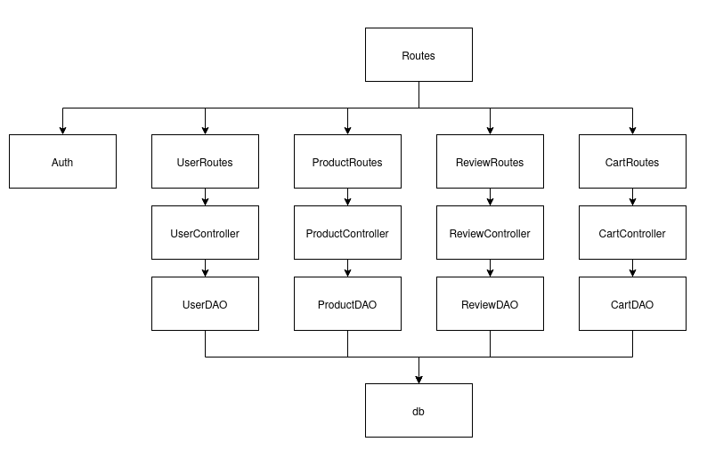
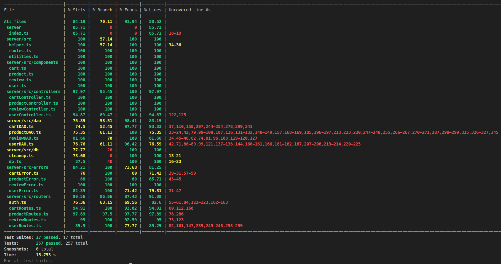

# Test Report

The main goal of this document is to provide a detailed report of the tests that have been developed for the project. The document will provide an overview of the test cases that have been developed for the project. The document will also provide an overview of the coverage of the test cases and the integration approach that was used to develop the tests.

In this document, the test cases have been divided into the three main login section of the software in question: User, Product, Cart, and Review. Each category contains a set of test cases that have been developed for the project. The test cases have been developed using different techniques such as White-Box and Black-Box.

# Contents

- [Test Report](#test-report)
- [Contents](#contents)
- [Dependency graph](#dependency-graph)
- [Integration approach](#integration-approach)
- [Tests](#tests)
- [Coverage](#coverage)
  - [Coverage of FR](#coverage-of-fr)
  - [Coverage white box](#coverage-white-box)

# Dependency graph

# Integration approach

For our project, we adopted a mixed integration approach to maximize team efficiency. This approach involved developing unit tests and integration tests in parallel. The unit tests were designed using the White-Box technique, providing detailed validation of individual components. The integration tests employed instead the Black-Box technique, focusing on the interactions between different components without regard to internal implementations.

Integration Sequence:

    Step 1: Unit testing of individual components:
        Cart (DAO, Controller, Route)
        Review (DAO, Controller, Route)
        User (DAO, Controller, Route)
        Product (DAO, Controller, Route)
    Step 2: Integration testing
        Testing routes (Cart, Review, User, Product) to ensure end-to-end functionality.

By following this sequence, we ensured that each component was individually verified and integrated seamlessly. This approach allowed us to identify and address issues at both the unit and integration levels, making sure that the final product was robust and reliable.

# Tests

## User
| Test N# | Test case name                    | Object(s) tested            | Test level | Technique used |
|:---:|:---------------------------------:|:---------------------------:|:----------:|:--------------:|
| **###\_\_DAO\_\_###** |                   |                             |            |                |
| 1.1 | user correctly authenticated      | UserDao.getIsUserAuthenticated | Unit       | White-Box      |
| 1.2 | user correctly created            | UserDao.createUser              | Unit       | White-Box      |
| 1.3 | get user correctly                | UserDao.getUserByUsername        | Unit       | White-Box      |
| 1.4 |user create error when DB error   | UserDao.createUser              | Unit       | White-Box      |
| 1.5 |user authentication error when DB error | UserDao.getIsUserAuthenticated | Unit       | White-Box      |
| 1.6 |get users correctly               | UserDao.getUsers                | Unit       | White-Box      |
| 1.7 |get users by role correctly       | UserDao.getUsersByRole          | Unit       | White-Box      |
| 1.8 |delete user correctly             | UserDao.deleteUser               | Unit       | White-Box      |
| **###\_\_Controller\_\_###**            |   |                             |            |                |
| 2.1 |user correctly created            | UserController.createUser       | Unit       | White-Box      |
| 2.2 |user creation error when user already exists | UserController.createUser | Unit       | White-Box      |
| 2.3 |user creation error when DB error | UserController.createUser       | Unit       | White-Box      |
| 2.4 |get users correctly               | UserController.getUsers         | Unit       | White-Box      |
| 2.5 |get users error when DB error     | UserController.getUsers         | Unit       | White-Box      |
| 2.6 |get users by role correctly       | UserController.getUsersByRole   | Unit       | White-Box      |
| 2.7 |get users by role error when DB error | UserController.getUsersByRole | Unit       | White-Box      |
| 2.8 |get user by username correctly (admin) | UserController.getUserByUsername | Unit       | White-Box      |
| 2.9 |get user by username correctly (self) | UserController.getUserByUsername | Unit       | White-Box      |
| 2.10 |get user by username error (not authorized) | UserController.getUserByUsername | Unit       | White-Box      |
| 2.11 |delete user correctly (self)      | UserController.deleteUser       | Unit       | White-Box      |
| 2.12 |delete user correctly (admin)     | UserController.deleteUser       | Unit       | White-Box      |
| 2.13 |delete user error (admin deleting admin) | UserController.deleteUser   | Unit       | White-Box      |
| 2.14 |delete user error (non-admin deleting another user) | UserController.deleteUser | Unit | White-Box      |
| 2.15 |delete all users correctly        | UserController.deleteAll        | Unit       | White-Box      |
| 2.16 |delete all users error when DB error | UserController.deleteAll      | Unit       | White-Box      |
| 2.17 |update user info correctly (self) | UserController.updateUserInfo   | Unit       | White-Box      |
| 2.18 |update user info correctly (admin) | UserController.updateUserInfo  | Unit       | White-Box      |
| 2.19 |update user info error (admin updating admin) | UserController.updateUserInfo | Unit | White-Box      |
| 2.20 |update user info error (admin updating non-existing user) | UserController.updateUserInfo | Unit | White-Box      |
| 2.21 |update user info error (non-admin updating another user) | UserController.updateUserInfo | Unit | White-Box      |
| **###\_\_Routes\_\_###** |  |                             |            |                |
| 3.1 |success in API for creating a new user (200)    | POST /users    | Unit | White-Box      |
| 3.2 |failure in API for creating a new user (422)    | POST /users    | Unit | White-Box      |
| 3.3 |success in API for retrieving all users (200)   | GET /users     | Unit | White-Box      |
| 3.4 |failure in API for retrieving all users (401)  | GET /users     | Unit | White-Box      |
| 3.5 |success in API for retrieving users by role (200) | GET /users/roles/:role | Unit | White-Box      |
| 3.6 |failure in API for retrieving users by role (422) | GET /users/roles/:role | Unit | White-Box      |
| 3.7 |success in API for retrieving a user by username (200) | GET /users/:username | Unit | White-Box      |
| 3.8 |success in API for deleting a user by username (200) | DELETE /users/:username | Unit | White-Box      |
| 3.9 |success in API for deleting all users (200)   | DELETE /users  | Unit | White-Box      |
| 3.10 |success in API for updating a user by username (200) | PATCH /users/:username | Unit | White-Box      |
| **###\_\_Integration\_\_###** |  |                             |            |                |
| 4.1 | success in creating a new user (200)  | POST /users                   | Integration | Black-Box      |
| 4.2 | failure in creating a new user with empty/missing fields (422) | POST /users | Integration | Black-Box |
| 4.3 | failure in creating a user with existing username (409) | POST /users | Integration | Black-Box |
| 4.4 | success in retrieving all users (200)   | GET /users                    | Integration | Black-Box      |
| 4.5 | failure in retrieving all users without admin rights (401) | GET /users  | Integration | Black-Box |
| 4.6 | success in retrieving users by role (200) | GET /users/roles/:role        | Integration | Black-Box      |
| 4.7 | failure in retrieving users by invalid role (422) | GET /users/roles/:role | Integration | Black-Box |
| 4.8 | failure in retrieving users by role without admin rights (401) | GET /users/roles/:role | Integration | Black-Box |
| 4.9 | success in retrieving a user by username (200) | GET /users/:username       | Integration | Black-Box      |
| 4.10 | failure in retrieving a user by username without admin rights (401) | GET /users/:username | Integration | Black-Box |
| 4.11 | failure in retrieving a non-existing user (404) | GET /users/:username     | Integration | Black-Box |
| 4.12 | success in deleting a user by username (200) | DELETE /users/:username    | Integration | Black-Box      |
| 4.13 | failure in deleting a non-existing user (404) | DELETE /users/:username   | Integration | Black-Box |
| 4.14 | failure in deleting a user without admin rights (401) | DELETE /users/:username | Integration | Black-Box |
| 4.15 | failure in admin deleting another admin (401) | DELETE /users/:username   | Integration | Black-Box |
| 4.16 | success in deleting all non-admin users (200) | DELETE /users             | Integration | Black-Box      |
| 4.17 | failure in deleting all users without admin rights (401) | DELETE /users | Integration | Black-Box |
| 4.18 | success in updating a user by username (200) | PATCH /users/:username     | Integration | Black-Box      |
| 4.19 | failure in updating a non-existing user (404) | PATCH /users/:username    | Integration | Black-Box |
| 4.20 | failure in updating a user with future birthdate (422) | PATCH /users/:username | Integration | Black-Box |
| 4.21 | failure in updating a user without admin rights (401) | PATCH /users/:username | Integration | Black-Box |
| 4.22 | failure in updating a user with empty/missing fields (422) | PATCH /users/:username | Integration | Black-Box |

## Product

| Test N# | Test case name | Object(s) tested | Test level | Technique used |
|:---:|:------------ | :--------------- | :--------- | :------------- |
|**###\_\_DAO\_\_###** |  |                |                      |            |                |
| 5.1 | Retrieve products by model | ProductDAO.getProductByModel | Unit | White-Box |
| 5.2 | Create a product | ProductDAO.createProduct | Unit | White-Box |
| 5.3 | Add quantity to a product | ProductDAO.addProductQuantity | Unit | White-Box |
| 5.4 | Remove quantity from a product | ProductDAO.removeProductQuantity | Unit | White-Box |
| 5.5 | Retrieve products by category | ProductDAO.getProductsByCategory | Unit | White-Box |
| 5.6 | Retrieve all products | ProductDAO.getAllProducts | Unit | White-Box |
| 5.7 | Delete a product by model | ProductDAO.deleteProductByModel | Unit | White-Box |
| 5.8 | Delete all products | ProductDAO.deleteAllProducts | Unit | White-Box |
| 5.9 | Retrieve available products | ProductDAO.getAvailableProducts | Unit | White-Box |
| 5.10 | Retrieve available products by category | ProductDAO.getAvailableProductsByCategory | Unit | White-Box |
| 5.11 | Retrieve available product by model | ProductDAO.getAvailableProductByModel | Unit | White-Box |
**###\_\_Controller\_\_###**  |  |                |                      |            |                |
| 6.1 | success in registerProducts | ProductController.registerProducts | Unit | White-Box |
| 6.2 | failure in registerProducts | ProductController.registerProducts | Unit | White-Box |
| 6.3 | date format error in registerProducts | ProductController.registerProducts | Unit | White-Box |
| 6.4 | success in changeProductQuantity | ProductController.changeProductQuantity | Unit | White-Box |
| 6.5 | failure in changeProductQuantity | ProductController.changeProductQuantity | Unit | White-Box |
| 6.6 | date format error in changeProductQuantity | ProductController.changeProductQuantity | Unit | White-Box |
| 6.7 | success in sellProduct | ProductController.sellProduct | Unit | White-Box |
| 6.8 | failure in sellProduct | ProductController.sellProduct | Unit | White-Box |
| 6.9 | date format error in sellProduct | ProductController.sellProduct | Unit | White-Box |
| 6.10 | success in getProducts by model | ProductController.getProducts | Unit | White-Box |
| 6.11 | failure in getProducts by model | ProductController.getProducts | Unit | White-Box |
| 6.12 | success in getProducts by category | ProductController.getProducts | Unit | White-Box |
| 6.13 | failure in getProducts by category | ProductController.getProducts | Unit | White-Box |
| 6.14 | getAllProducts when grouping is not model or category in getProducts | ProductController.getProducts | Unit | White-Box |
| 6.15 | success in getAvailableProducts by model | ProductController.getAvailableProducts | Unit | White-Box |
| 6.16 | failure in getAvailableProducts by model | ProductController.getAvailableProducts | Unit | White-Box |
| 6.17 | success in getAvailableProducts by category | ProductController.getAvailableProducts | Unit | White-Box |
| 6.18 | failure in getAvailableProducts by category | ProductController.getAvailableProducts | Unit | White-Box |
| 6.19 | getAllProducts when grouping is not model or category in getAvailableProducts | ProductController.getAvailableProducts | Unit | White-Box |
| 6.20 | success in deleteAllProducts | ProductController.deleteAllProducts | Unit | White-Box |
| 6.21 | failure in deleteAllProducts | ProductController.deleteAllProducts | Unit | White-Box |
| 6.22 | success in deleteProduct | ProductController.deleteProduct | Unit | White-Box |
| 6.23 | failure in deleteProduct | ProductController.deleteProduct | Unit | White-Box |
|**###\_\_Routes\_\_###** |  |      |              |            |                |
| 7.1 |success in API for creating product (200)          | POST /products           | Unit | White-Box      |
| 7.2 |success in API for changing product quantity (200)  | PATCH /products/:model   | Unit | White-Box      |
| 7.3 |success in API for selling a product (200)         | PATCH /products/:model/sell | Unit | White-Box      |
| 7.4 |success in API for retrieving products (200)        | GET /products             | Unit | White-Box      |
| 7.5 |success in API for filtering products by category (200) | GET /products?grouping=category&category=Smartphone | Unit | White-Box      |
| 7.6 |success in API for filtering products by model   (200) | GET /products?grouping=model&model=test | Unit | White-Box      |
| 7.7 |success in API for retrieving available products (200) | GET /products/available   | Unit | White-Box      |
| 7.8 |success in API for deleting a product  (200)        | DELETE /products/:model   | Unit | White-Box      |
| 7.9 |success in API for deleting all products (200)      | DELETE /products          | Unit | White-Box      |
| **###\_\_Integration\_\_###** |  |        |       |            |                |
| 8.1 | Successful creation of a product (200) | POST /products | Integration | Black-Box  |
| 8.2 | Duplicate product creation (409) | POST /products | Integration | Black-Box |
| 8.3 | Invalid date during product creation (400) | POST /products | Integration | Black-Box |
| 8.4 | Successful change in product quantity (200) | PATCH /products/:model | Integration | Black-Box |
| 8.5 | Invalid change date during product quantity change (400) | PATCH /products/:model | Integration | Black-Box |
| 8.6 | Change date before arrival date during product quantity change (400) | PATCH /products/:model | Integration | Black-Box |
| 8.7 | Authorization error during product quantity change (401) | PATCH /products/:model | Integration | Black-Box |
| 8.8 | Failure in product quantity change wrong fields (422) | PATCH /products/:model | Integration | Black-Box |
| 8.9 | Successful product sale manager (200) | PATCH /products/:model/sell | Integration | Black-Box|
| 8.10 | Successful product sale admin (200) | PATCH /products/:model/sell | Integration | Black-Box |
| 8.10 | Failure in selling a non existing product (404) | PATCH /products/:model/sell | Integration | Black-Box |
| 8.11 | Selling date after current date during product sale (400) | PATCH /products/:model/sell | Integration | Black-Box |
| 8.12 | Selling date before arrival date during product sale (400) | PATCH /products/:model/sell | Integration | Black-Box |
| 8.13 | Insufficient quantity for sale during product sale (409) | PATCH /products/:model/sell | Integration | Black-Box |
| 8.14 | Authorization error during product sale customer (401) | PATCH /products/:model/sell | Integration | Black-Box |
| 8.15 | Failure in product sale wrong fields (422) | PATCH /products/:model/sell | Integration | Black-Box |
| 8.16 | Successful filtering of products by category (200) | GET /products | Integration | Black-Box |
| 8.17 | Successful filtering of products by model (200) | GET /products | Integration | Black-Box |
| 8.18 | Failure in filtering product by category grouping null, category/model not null (422) | GET /products | Integration | Black-Box |
| 8.19 | Failure in filtering product by category, category null (422) | GET /products | Integration | Black-Box |
| 8.20 | Failure in filtering product by model, model null (422) | GET /products | Integration | Black-Box |
| 8.21 | Failure in filtering products by model when model no existing (404) | GET /products | Integration | Black-Box |
| 8.22 | Failure in filtering by category when category not valid (422) | GET /products | Integration | Black-Box |
| 8.23 | Authentication error during filtering products, customer (401) | GET /products | Integration | Black-Box |
| 8.24 | Successful retrieval of available products by category (200) | GET /products/available | Integration | Black-Box |
| 8.25 | Successful retrieval of available of products by model (200) | GET /products/available | Integration | Black-Box |
| 8.26 | Failure in retrieval available product by category grouping null, category/model not null (422) | GET /products/available | Integration | Black-Box |
| 8.27 | Failure in retrieval available product by category, category null (422) | GET /products/available | Integration | Black-Box |
| 8.28 | Failure in retrieval of available product by model, model null (422) | GET /products/available | Integration | Black-Box |
| 8.29 | Failure in retrieval of available products by model when model not existing (404) | GET /products/available | Integration | Black-Box |
| 8.30 | Failure in retrieval of available products by category when category not valid (422) | GET /products/available | Integration | Black-Box |
| 8.31 | Successful deletion of a product (200) | DELETE /products/:model | Integration | Black-Box |
| 8.32 | Successful deletion of a non existing product (404) | DELETE /products/:model | Integration | Black-Box |
| 8.33 | Authorization error during product deletion, customer (401) | DELETE /products/:model | Integration | Black-Box |
| 8.34 | Successful deletion of all products (200) | DELETE /products | Integration | Black-Box |
| 8.35 | Authorization error during deletion of all products, customer (401) | DELETE /products | Integration | Black-Box |

## Cart
| Test N# |Test case name | Object(s) tested | Test level | Technique used |
|:--: | :------------: | :--------------: | :--------: | :------------: |
| **###\_\_DAO\_\_###**                       |        |                                  |            |                |
| 9.1 | success in get cart | CartDao.getCart | Unit | White-Box |
|  **###\_\_Controller\_\_###**         | |   |    |     |
| 10.1 | success in add to cart | CartController.addToCart | Unit | White-Box |
| 10.2 | failure in add to cart | CartController.addToCart | Unit | White-Box |
| 10.3 | success in get cart | CartController.getCart | Unit | White-Box |
| 10.4 | failure in get cart | CartController.getCart | Unit | White-Box |
| 10.5 | success in checkout cart                   | CartController.checkoutCart            | Unit       | White-Box      |
| 10.6 | failure in checkout cart                   | CartController.checkoutCart            | Unit       | White-Box      |
| 10.7 | success in get customer carts              | CartController.getCustomerCarts        | Unit       | White-Box      |
| 10.8 | failure in get customer carts              | CartController.getCustomerCarts        | Unit       | White-Box      |
| 10.9 | success in remove product from cart        | CartController.removeProductFromCart   | Unit       | White-Box      |
| 10.10 | failure in remove product from cart        | CartController.removeProductFromCart   | Unit       | White-Box      |
| 10.11| success in clear cart                      | CartController.clearCart               | Unit       | White-Box      |
| 10.12 |failure in clear cart                       | CartController.clearCart               | Unit       | White-Box      |
| 10.13 | success in delete all carts                | CartController.deleteAllCarts          | Unit       | White-Box      |
| 10.14 | failure in delete all carts                | CartController.deleteAllCarts          | Unit       | White-Box      |
| 10.15 | success in get all carts                   | CartController.getAllCarts             | Unit       | White-Box      |
| 10.16 |failure in get all carts                    | CartController.getAllCarts             | Unit       | White-Box      |
**###\_\_Routes\_\_###**          |          |          |              |               |
| 11.1    |   success in retrieving all cart (200)     |     GET /carts                      | Unit          | White-Box      |
| 11.2    |   success in adding a product to the cart (200) |              POST /carts             | Unit          | White-Box      |
| 11.3    |  success in checking out the current cart (200) |          PATCH /carts                 | Unit          | White-Box      |
| 11.4    | success in retrieving all carts of a user (200)  | GET /carts/history              | Unit          | White-Box      |
| 11.5    | success in deleting a product from the current user cart (200) | DELETE /carts/products/:model| Unit          | White-Box      |
| 11.6    | success in deleting the current cart of the user (200) | DELETE /carts/current | Unit          | White-Box      |
| 11.7    | success in deleting all carts (200) | DELETE /carts | Unit          | White-Box      |
| 11.8    | success in retrieving all carts (200) |GET /carts/all| Unit          | White-Box      |
| **###\_\_Integration\_\_###** |
| 12.1    | success in retrieving an empty cart for logged-in customer (200) | GET /carts | Integration | Black-Box |
| 12.2    | success in retrieving a non-empty cart for logged-in customer (200) | GET /carts | Integration | Black-Box |
| 12.3    | quantity increments when adding the same product multiple times (200) | POST /carts | Integration | Black-Box |
| 12.4    | access error when user is not logged in (401) | GET, POST, PATCH, DELETE /carts | Integration | Black-Box |
| 12.5    | access error when user is admin (401) | GET, POST, PATCH, DELETE /carts | Integration | Black-Box |
| 12.6    | access error when user is manager (401) | GET, POST, PATCH, DELETE /carts | Integration | Black-Box |
| 12.7    | success in setting cart to paid (200) | PATCH /carts | Integration | Black-Box |
| 12.8    | error when trying to set paid status without unpaid cart (404) | PATCH /carts | Integration | Black-Box |
| 12.9    | error when trying to set paid status with empty cart (400) | PATCH /carts | Integration | Black-Box |
| 12.10   | error when cart has products with no available quantity (409) | PATCH /carts | Integration | Black-Box |
| 12.11   | error when cart has products exceeding available quantity (409) | PATCH /carts | Integration | Black-Box |
| 12.12   | success in retrieving cart history for logged-in customer (200) | GET /carts/history | Integration | Black-Box |
| 12.13   | access error when user is not logged in for cart history (401) | GET /carts/history | Integration | Black-Box |
| 12.14   | access error when user is admin for cart history (401) | GET /carts/history | Integration | Black-Box |
| 12.15   | access error when user is manager for cart history (401) | GET /carts/history | Integration | Black-Box |
| 12.16   | success in removing product from cart (200) | DELETE /carts/products/:model | Integration | Black-Box |
| 12.17   | error when user is not logged in for removing product (401) | DELETE /carts/products/:model | Integration | Black-Box |
| 12.18   | error when user is admin for removing product (401) | DELETE /carts/products/:model | Integration | Black-Box |
| 12.19   | error when user is manager for removing product (401) | DELETE /carts/products/:model | Integration | Black-Box |
| 12.20   | error when product does not exist for removal (404) | DELETE /carts/products/:model | Integration | Black-Box |
| 12.21   | error when product is not in the cart for removal (404) | DELETE /carts/products/:model | Integration | Black-Box |
| 12.22   | error when no unpaid cart exists for removal (404) | DELETE /carts/products/:model | Integration | Black-Box |
| 12.23   | error when cart is empty for removal (404) | DELETE /carts/products/:model | Integration | Black-Box |
| 12.24   | success in clearing current cart (200) | DELETE /carts/current | Integration | Black-Box |
| 12.25   | error when user is not logged in for clearing current cart (401) | DELETE /carts/current | Integration | Black-Box |
| 12.26   | error when user is admin for clearing current cart (401) | DELETE /carts/current | Integration | Black-Box |
| 12.27   | error when user is manager for clearing current cart (401) | DELETE /carts/current | Integration | Black-Box |
| 12.28   | error when no unpaid cart exists for clearing current cart (404) | DELETE /carts/current | Integration | Black-Box |
| 12.29   | success in deleting all carts by manager (200) | DELETE /carts | Integration | Black-Box |
| 12.30   | success in deleting all carts by admin (200) | DELETE /carts | Integration | Black-Box |
| 12.31   | error when user is not logged in for deleting all carts (401) | DELETE /carts | Integration | Black-Box |
| 12.32   | error when user is customer for deleting all carts (401) | DELETE /carts | Integration | Black-Box |
| 12.33   | success in retrieving all carts by admin (200) | GET /carts/all | Integration | Black-Box |
| 12.34   | success in retrieving all carts by manager (200) | GET /carts/all | Integration | Black-Box |
| 12.35   | error when user is not logged in for retrieving all carts (401) | GET /carts/all | Integration | Black-Box |
| 12.36   | error when user is customer for retrieving all carts (401) | GET /carts/all | Integration | Black-Box |

## Review
| Test N# | Test case name                            | Object(s) tested                  | Test level | Technique used |
|:--: |:---------------------------------------: | :-------------------------------: | :--------: | :------------: |
| **###\_\_DAO\_\_###**                |        |                 |            |                |
| 13.1 |add review correctly                      | ReviewDAO.addReview               | Unit       | White-Box      |
| 13.2 |get review correctly                      | ReviewDAO.getProductReviews       | Unit       | White-Box      |
| 13.3 |delete review correctly                   | ReviewDAO.deleteReview            | Unit       | White-Box      |
| 13.4 |delete all reviews of a product correctly | ReviewDAO.deleteReviewsOfProduct  | Unit       | White-Box      |
| 13.5 |delete all reviews correctly              | ReviewDAO.deleteAllReviews        | Unit       | White-Box      |
| **###\_\_Controller\_\_###**          |             |             |            |                |
| 14.1 |add review controller success             | ReviewController.addReview        | Unit       | White-Box      |
| 14.2 |add review controller failure             | ReviewController.addReview        | Unit       | White-Box      |
| 14.3 |get reviews controller success            | ReviewController.getProductReviews | Unit       | White-Box      |
| 14.4 |get reviews controller failure            | ReviewController.getProductReviews | Unit       | White-Box      |
| 14.5 |delete review controller success          | ReviewController.deleteReview     | Unit       | White-Box      |
| 14.6 |delete review controller failure          | ReviewController.deleteReview     | Unit       | White-Box      |
| 14.7 |delete reviews of product controller success | ReviewController.deleteReviewsOfProduct | Unit | White-Box |
| 14.8 |delete reviews of product controller failure | ReviewController.deleteReviewsOfProduct | Unit | White-Box |
| 14.9 |delete all reviews controller success     | ReviewController.deleteAllReviews | Unit       | White-Box      |
| 14.10 |delete all reviews controller failure     | ReviewController.deleteAllReviews | Unit       | White-Box      |
| **###\_\_Routes\_\_###** |  |  |  |  |
| 15.1  | success in adding a review to a product (200)  | POST /reviews/:model                           | Unit       | White-Box      |
| 15.2  | success in retrieving all reviews of a model (200)  | GET /reviews/:model                                 | Unit       | White-Box      |
| 15.3  | success in deleting own review of a model (200)  | DELETE /reviews/:model                           | Unit       | White-Box      |
| 15.4  | success in deleting all reviews of a model (200)  | DELETE /reviews/:model/all                   | Unit       | White-Box      |
| 15.5  | success in deleting all reviews of all products (200)  | DELETE /reviews                              | Unit       | White-Box      |
| **###\_\_Integration\_\_###** |  |  |  |  |
| 16.1     | success in adding a review to a product (200)                      | POST /reviews/:model                      | Integration  | Black-Box      |
| 16.2     | error if model does not exist when adding a review (404)           | POST /reviews/:model                      | Integration  | Black-Box      |
| 16.3     | error if user is not logged in when adding a review (401)          | POST /reviews/:model                      | Integration  | Black-Box      |
| 16.4     | error if user is manager when adding a review (401)                | POST /reviews/:model                      | Integration  | Black-Box      |
| 16.5     | error if user is admin when adding a review (401)                  | POST /reviews/:model                      | Integration  | Black-Box      |
| 16.6    | error if user has already reviewed the product (409)              | POST /reviews/:model                      | Integration  | Black-Box      |
| 16.7     | success in retrieving all reviews of a model (200)                 | GET /reviews/:model                       | Integration  | Black-Box      |
| 16.8    | error if user is not logged in when retrieving reviews (401)      | GET /reviews/:model                       | Integration  | Black-Box      |
| 16.9     | success in deleting own review of a model (200)                    | DELETE /reviews/:model                    | Integration  | Black-Box      |
| 16.10    | error if user is not logged in when deleting a review (401)       | DELETE /reviews/:model                    | Integration  | Black-Box      |
| 16.11    | error if user is manager when deleting a review (401)              | DELETE /reviews/:model                    | Integration  | Black-Box      |
| 16.12    | error if user is admin when deleting a review (401)                | DELETE /reviews/:model                    | Integration  | Black-Box      |
| 16.13    | error if model does not exist when deleting a review (404)         | DELETE /reviews/:model                    | Integration  | Black-Box      |
| 16.14    | error if user has not reviewed the product when deleting (404)    | DELETE /reviews/:model                    | Integration  | Black-Box      |
| 16.15     | success in deleting all reviews of a model by manager (200)                   | DELETE /reviews/:model/all                | Integration  | Black-Box      |
| 16.16     | success in deleting all reviews of a model by admin (200)                   | DELETE /reviews/:model/all                | Integration  | Black-Box      |
| 16.17    | error if user is not an admin or manager when deleting all reviews (401) | DELETE /reviews/:model/all                | Integration  | Black-Box      |
| 16.18    | error if user is not logged in when deleting all reviews (401)           | DELETE /reviews/:model/all                | Integration  | Black-Box      |
| 16.19    | error if model does not exist when deleting all reviews (404)         | DELETE /reviews/:model/all                | Integration  | Black-Box      |
| 16.20    | success in deleting all reviews by manager (200)                   | DELETE /reviews                           | Integration  | Black-Box      |
| 16.21    | success in deleting all reviews by admin (200)                     | DELETE /reviews                           | Integration  | Black-Box      |
| 16.22    | error if user is not an admin or manager when deleting all reviews (401) | DELETE /reviews                           | Integration  | Black-Box      |

# Coverage

## Coverage of FR

<Report in the following table the coverage of functional requirements and scenarios(from official requirements) >

| Functional Requirement or scenario | Test(s) |
| :--------------------------------: | :-----: |
|                FRx                 |         |
|                FRy                 |         |
|                ...                 |         |

## Coverage white box

